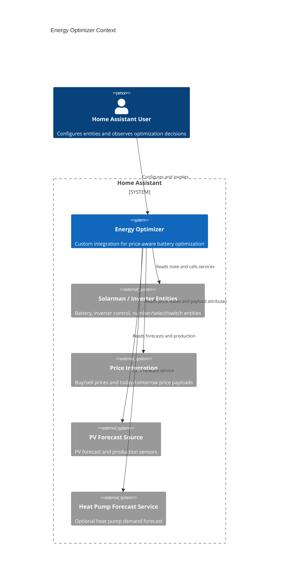
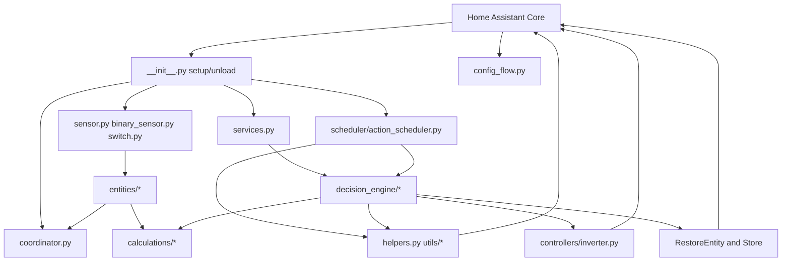
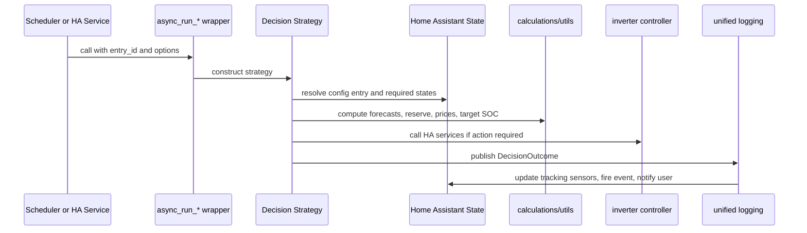
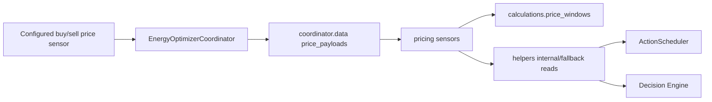

# Project Architecture Blueprint

Generated: 2026-07-08

Scope: Energy Optimizer Home Assistant custom integration in `custom_components/energy_optimizer/`.

This blueprint describes the architecture implemented in the current codebase. It is intended as the reference for preserving architectural consistency when adding features, refactoring modules, or reviewing changes.

## 1. Architecture Detection And Analysis

### Detected Technology Stack

- Primary language: Python 3.12 style code using `from __future__ import annotations` and modern typing.
- Runtime framework: Home Assistant custom integration.
- Distribution model: HACS-compatible custom repository.
- Configuration model: Home Assistant config entries and options flow, UI-only.
- Entity platforms: `sensor`, `binary_sensor`, and `switch`.
- Scheduling model: Home Assistant event helpers such as `async_track_time_change`, `async_track_state_change_event`, `async_track_sunrise`, and `async_track_sunset`.
- Persistence model: Home Assistant restore entities and `homeassistant.helpers.storage.Store`.
- Validation: `voluptuous` plus Home Assistant selectors in config flow and service schemas.
- Testing: pytest, pytest-asyncio, Home Assistant test utilities, `MagicMock`/`AsyncMock`, and focused unit/integration-style tests.
- Packaging metadata: `custom_components/energy_optimizer/manifest.json`, `hacs.json`, and `services.yaml`.

### Detected Architecture Pattern

The integration is a modular monolith with a Home Assistant platform adapter shell and a layered internal architecture.

The main layers are:

1. Home Assistant integration shell: setup/unload, config flow, platforms, services.
2. Coordination and entity publication: coordinator snapshots plus HA entities.
3. Scheduling and command entry: time/event triggers and service handlers.
4. Decision engine: scenario-specific business decisions.
5. Domain calculations and utility helpers: pure or mostly pure computation and state parsing.
6. Control adapters: Home Assistant service calls for inverter and switch side effects.

The strongest architectural pattern is a layered architecture with template-method strategy bases in the decision engine. There are also adapter patterns around Home Assistant state, entity registry, service calls, notification/logging, and restore storage.

### Architectural Principles Evident In Code

- Home Assistant owns lifecycle, state, services, and persistence; the integration adapts to HA rather than creating an independent runtime.
- Configuration flows define the integration contract. YAML configuration is not part of the active architecture.
- Decision engine public entry points stay as module-level `async_run_*()` wrappers.
- Scenario modules keep domain rules close to the action they govern.
- Shared charge and sell workflows are factored into base strategies when repetition is meaningful.
- Calculation functions stay deterministic where possible and are tested directly.
- Entity state is published through coordinator entities and restore-capable diagnostic sensors.
- Side effects are isolated in controller helpers and guarded by test mode where appropriate.
- Optional sources degrade gracefully to safe skips, defaults, or no-op decisions.

## 2. Architectural Overview

Energy Optimizer optimizes battery charge, sell, and export behavior for a Home Assistant installation. It consumes configured Home Assistant entities for prices, PV forecasts, load, battery state, and inverter controls. It publishes derived sensors and provides services/scheduler triggers that execute decision-engine scenarios.

The architecture is intentionally local. There is no external API server, database, message broker, or background worker outside Home Assistant. All long-lived state is held in HA entities, `hass.data`, restored entity state, or HA storage.

### Major Runtime Paths

- Setup path: config entry -> coordinator first refresh -> platform setup -> service registration -> scheduler start.
- Entity update path: configured entity changes -> coordinator refresh -> entity properties recalculate values.
- Scheduled action path: scheduler trigger -> `async_run_*()` decision entry point -> strategy evaluates state -> controller applies HA service calls -> unified logging publishes outcome.
- Manual service path: HA service call -> registered service handler -> same `async_run_*()` decision entry point used by scheduler.
- Restore path: HA restart -> restore entities reload published state; sell restore storage reloads pending restore requests.

## 3. Architecture Visualization

### C4 Context



### Container / Package View



### Decision Execution Flow



### Market Window Data Flow



## 4. Core Architectural Components

### Integration Shell

Files: `__init__.py`, `manifest.json`, `hacs.json`.

Purpose:

- Register the integration domain, platforms, services, coordinator, scheduler, and config-entry lifecycle.
- Keep Home Assistant lifecycle concerns out of business modules.

Internal structure:

- `PLATFORMS` defines `sensor`, `binary_sensor`, and `switch` platforms.
- `async_setup_entry()` creates per-entry `hass.data[DOMAIN][entry.entry_id]`, performs first coordinator refresh, forwards platform setup, registers services once, and starts the scheduler.
- `async_unload_entry()` unloads platforms, stops the scheduler, and removes entry data.
- Options updates call `async_reload_entry()`.

Interaction patterns:

- Home Assistant invokes setup/unload/reload callbacks.
- Platform files pull shared entry state from `hass.data`.
- Scheduler and entities are stored in `hass.data` for later cross-component access.

Evolution patterns:

- Add a new platform by extending `PLATFORMS` and adding a platform file.
- Add new per-entry long-lived runtime collaborators under `hass.data[DOMAIN][entry_id]`.
- Keep service registration one-time, not per config entry.

### Config Flow And Options Flow

File: `config_flow.py`.

Purpose:

- Capture all integration configuration through the Home Assistant UI.
- Validate entity domains and numeric parameter ranges before creating or updating a config entry.

Internal structure:

- Multi-step `EnergyOptimizerConfigFlow` collects price entities, battery sensors, battery parameters, control entities, program entities, forecast entities, heat-pump options, and advanced settings.
- `EnergyOptimizerOptionsFlow` mirrors editable settings after setup.
- Selectors constrain entity domains and numeric inputs.

Interaction patterns:

- Uses `vol.Schema`, `selector.EntitySelector`, `selector.NumberSelector`, and domain-specific validation helpers.
- Stores stable configuration in `config_entry.data`; runtime switches can override selected config booleans through HA entities.

Evolution patterns:

- New optional integration fields should be added to both ConfigFlow and OptionsFlow when user-editable after setup.
- Validate entity domain where possible.
- Preserve backward compatibility by using `.get()` defaults when adding optional config keys.

### Coordinator

File: `coordinator.py`.

Purpose:

- Centralize lightweight polling of configured input entities.
- Provide a stable snapshot for sensors without requiring every entity to read HA state separately.

Internal structure:

- Extends `DataUpdateCoordinator[dict[str, Any]]`.
- Polls every five minutes.
- Builds `data["states"]` for numeric configured sensors.
- Builds `data["price_payloads"]` by copying `prices_today` and `prices_tomorrow` attributes from configured buy/sell price sensors.

Interaction patterns:

- Entity classes read `self.coordinator.data`.
- Platform setup registers state-change listeners for important source entities and requests coordinator refresh.

Evolution patterns:

- Add coordinator data only for shared, low-cost, frequently reused inputs.
- Deep-copy external payload attributes before storing them.
- Keep action-time reads in helpers when values must reflect immediate HA state.

### Entity Platforms And Entity Model

Files: `sensor.py`, `binary_sensor.py`, `switch.py`, `entities/base.py`, `entities/sensors/*`.

Purpose:

- Publish integration state, diagnostics, calculated prices/windows, and runtime toggles to Home Assistant.

Internal structure:

- `EnergyOptimizerEntity` extends `CoordinatorEntity`, sets `_attr_has_entity_name = True`, device info, no polling, and entry-prefixed unique IDs.
- Sensor modules split by concern: battery/config values, pricing windows, and tracking/diagnostics.
- Binary sensors store operational flags such as balancing ongoing and afternoon grid assist.
- Switches publish runtime controls such as test mode, test sell mode, and PV forecast compensation usage.
- Restore-capable entities persist selected state across restarts.

Interaction patterns:

- Sensors are instantiated in `sensor.py` and added through `async_add_entities`.
- Selected sensors are stored in `hass.data` for decision logging, schedule snapshots, battery space checks, and compensation use.
- Pricing sensors recalculate from coordinator price payloads and pure calculation functions.

Evolution patterns:

- New sensors should extend `EnergyOptimizerSensor` unless HA requires another entity type.
- Use translation keys for user-facing entity naming.
- Keep sensor native values lightweight and put structured diagnostics in attributes.
- Use `_unrecorded_attributes` for heavy diagnostic attributes.

### Pricing And Market Window Calculations

Files: `calculations/price_windows.py`, `entities/sensors/pricing.py`, selected helpers in `helpers.py`.

Purpose:

- Normalize price payloads and derive Buy Windows, Ranked Sell Windows, and Midday Avoidance Windows.
- Publish those windows as Home Assistant sensors and expose values to Scheduler and Decision Engine through helper reads.

Internal structure:

- Dataclasses describe normalized hourly and quarter-hour inputs plus result shapes.
- Buy Window calculations select two contiguous full-hour windows.
- Ranked Sell Window calculations select primary and secondary one-hour candidates.
- Midday Avoidance calculations expand hourly sell prices to quarter-hour slots and select a two-hour or zero-price-expanded window.
- Pricing sensors format calculated results into HA states and attributes.

Interaction patterns:

- Coordinator supplies raw day payloads.
- Calculation functions return dataclasses or `None`.
- Sensors translate results to native values, attributes, and availability.
- Helpers prefer integration-owned internal sensors and then configured fallback entities for action-time reads.

Evolution patterns:

- Preserve day isolation, duplicate handling, tie-breakers, and publication precision.
- Keep calculation dataclasses internal to the calculation/module layer.
- The planned deeper Market Window module should expose a smaller caller-facing interface while preserving category-specific internal result shapes.

### Scheduler

File: `scheduler/action_scheduler.py`.

Purpose:

- Bridge clock/state events into decision-engine entry points.
- Publish a diagnostic schedule snapshot for visibility.

Internal structure:

- Fixed triggers: morning charge, evening behavior, daily refresh.
- Dynamic triggers: afternoon charge, morning/evening sell windows, sell restores, daytime min-price restore.
- Event-driven rescheduling: high-tariff start and internal Market Window sensor changes.
- Daylight-gated hourly controls: solar charge block followed by export block control.

Interaction patterns:

- Calls public `async_run_*()` decision-engine wrappers with `entry_id`.
- Uses helper functions to resolve dynamic hours and internal sensor entity IDs.
- Updates `ScheduledActionsSensor` through `hass.data`.

Evolution patterns:

- Use event-driven listeners for entity-state-driven rescheduling.
- Use `_schedule_*` methods where time listeners must be recalculated.
- Keep business safety guards in decision-engine modules, not only in scheduler triggers.

### Services And Service Handlers

Files: `services.py`, `services.yaml`, `service_handlers/*`.

Purpose:

- Expose manual HA service entry points for the same decision flows used by the scheduler.
- Handle specialized operational flows such as balancing completion and sell restore.

Internal structure:

- `services.py` defines service schemas and registers handlers.
- Handlers call module-level `async_run_*()` functions.
- `sell_restore.py` persists and executes delayed restoration after sell windows.

Interaction patterns:

- HA service calls pass optional `entry_id` and `margin` values.
- Service schemas use `voluptuous` validation.
- Restore handlers use `Store` plus `hass.data` for pending restore state.

Evolution patterns:

- New public actions should get a service schema, service YAML documentation, and a handler that delegates to a decision-engine entry point.
- Keep service handlers thin; business guards belong in the decision engine.

### Decision Engine

Files: `decision_engine/*`.

Purpose:

- Evaluate energy, price, forecast, and battery context to decide whether to charge, sell, restore, block solar charge, or switch export/off-grid behavior.

Internal structure:

- `common.py` defines dataclasses and shared forecast/energy helpers.
- `charge_base.py` provides the template workflow for charge scenarios.
- `sell_base.py` provides the template workflow and restore persistence for sell scenarios.
- Scenario modules implement hooks and scenario-specific rules.
- Public entry points remain module-level async functions such as `async_run_morning_charge()`.

Interaction patterns:

- Reads configuration from resolved config entries.
- Reads required and optional HA state through helpers.
- Calls pure calculations and forecast utilities.
- Applies changes through `controllers/inverter.py`.
- Emits `DecisionOutcome` via unified logging.

Evolution patterns:

- Add new decision scenarios as modules with an `async_run_*()` wrapper.
- Use existing base strategies if the workflow matches charge or sell patterns.
- Keep optional-source failures local and graceful when the scenario can safely skip only one branch.

### Calculations And Utilities

Files: `calculations/*`, `utils/*`, parts of `helpers.py`.

Purpose:

- Contain reusable arithmetic, time-window, forecast, parsing, and logging operations.

Internal structure:

- Battery and charging functions convert SOC, kWh, current, and capacity.
- Energy calculations compute reserve, needed energy, losses, sufficiency, export power, and demand.
- Utilities aggregate PV/heat-pump forecast windows and build hour windows.
- Helpers read and parse Home Assistant states, attributes, internal entities, time values, and config-driven defaults.

Interaction patterns:

- Decision engine imports calculations and utilities.
- Coordinator and helpers use `get_float_state_info()` for consistent numeric parsing.
- Forecast utilities may call HA services or read HA states depending on source.

Evolution patterns:

- Put deterministic arithmetic in `calculations/` and test it directly.
- Put HA-state parsing and fallback behavior in `helpers.py` or a more focused adapter module.
- Avoid moving side effects into calculation modules.

### Inverter Controller Adapter

File: `controllers/inverter.py`.

Purpose:

- Isolate Home Assistant service calls used to control inverter-related entities.

Internal structure:

- `_call_service()` wraps `hass.services.async_call`.
- Functions set program SOC, charge current, discharge current, export power, work mode, and switches.
- Each side-effect function checks test mode when a config entry is supplied.

Interaction patterns:

- Decision engine and restore handlers call controller functions instead of calling HA services directly.
- Controller functions accept `Context` for event correlation.

Evolution patterns:

- Add new inverter mutations here first, then call them from decisions.
- Preserve test-mode guards for all external side effects.

## 5. Architectural Layers And Dependency Rules

### Layer Map

```text
Home Assistant runtime
  -> Integration shell and platform files
    -> Entities, services, scheduler
      -> Decision engine and helpers
        -> Calculations and utilities
      -> Controllers for HA service side effects
```

### Dependency Rules

- `calculations/` should not depend on entities, services, scheduler, or controller side effects.
- `decision_engine/` may depend on calculations, helpers, utilities, and controllers.
- `scheduler/` may call decision-engine public wrappers and helper resolution functions, but should not duplicate business rules.
- `entities/` may consume coordinator data and calculations, but should not execute inverter side effects.
- `controllers/` may call Home Assistant services, but should not contain scenario business rules.
- `services.py` should remain a thin command adapter.
- Platform files should instantiate entities and register listeners, not own scenario logic.

### Known Layer Pressure

- `helpers.py` is broad. It currently contains entity-registry resolution, test-mode flags, active program resolution, numeric parsing, attribute fallback reads, tariff/window resolution, and state flags. This is useful as a compatibility hub but should be split carefully only when there is a stable target module.
- Market Window behavior is currently spread across calculations, pricing sensors, helpers, Scheduler, and Decision Engine reads. The Wayfinder plan records a future `market_windows` module to improve locality.
- Some older documentation describes YAML-era or earlier sensor names. Code should be treated as source of truth for this blueprint.

## 6. Data Architecture

### Primary Data Sources

- `config_entry.data`: durable configuration supplied by ConfigFlow and OptionsFlow.
- Home Assistant state machine: current input entity states and attributes.
- Coordinator snapshot: numeric states and price payload attributes for configured entities.
- Restore state: persistent values for tracking sensors and switches.
- HA storage `Store`: sell restore data that must survive restart.
- `hass.data[DOMAIN][entry_id]`: runtime object registry for coordinator, scheduler, sensors, switches, and pending restore memory.

### Domain Data Structures

- `BatteryConfig`: battery capacity, voltage, SOC bounds, and efficiency.
- `ForecastData`: time-window forecast inputs for decisions.
- `SufficiencyResult`: whether and when PV sufficiency is reached.
- `EnergyBalance`: reserve, required energy, needed reserve, and gap.
- `ChargeAction`: target SOC and charge current result.
- `DecisionOutcome`: cross-channel decision summary and details payload.
- Price-window dataclasses: hourly/quarter-hour normalized inputs and category-specific result types.
- Restore payloads: dicts persisted with sell type, restore hour, original program SOC/work mode, and timestamp.

### Validation And Transformation

- ConfigFlow validates user inputs before config entry creation.
- Service schemas validate manual service parameters.
- `get_float_state_info()` normalizes missing, unavailable, invalid, and valid numeric states.
- `get_required_float_state_or_attribute()` implements attribute-first price reads with state fallback.
- Price payload parsers accept datetime and ISO strings, normalize to local time, and reject invalid or duplicate full-hour entries where required.
- Sensor publication performs final formatting and rounding, not calculation-layer precision loss.

### Persistence And Caching

- Coordinator caches snapshots between updates.
- Restore sensors persist last balancing, last optimization, history, PV compensation, binary flags, and switch states.
- Sell restore uses `Store` for restart-safe pending restoration.
- Heavy diagnostic schedule attributes are excluded from recorder through `_unrecorded_attributes`.

## 7. Cross-Cutting Concerns

### Authentication And Authorization

There is no independent authentication or authorization layer. Energy Optimizer runs inside Home Assistant and inherits Home Assistant's user, service, and entity access model.

Security boundaries are therefore:

- Home Assistant config entry setup and UI access.
- Home Assistant service permissions.
- Entity IDs configured by the user.
- HACS distribution and repository trust.

The integration should not store credentials, secrets, tokens, or external account data.

### Error Handling And Resilience

Common patterns:

- Missing config or entity state logs an error/warning and returns `None`.
- Decision scenarios skip or degrade when optional inputs are missing.
- Defaults are used for tariff start/end and selected window hours where current behavior defines defaults.
- Controller functions no-op when optional target entity IDs are missing.
- Test mode prevents actual HA service mutations.
- Pending sell restore survives restarts through HA storage.

Avoid:

- Swallowing exceptions silently in side-effect code.
- Moving safety guards only into scheduler paths when manual services can trigger the same action.
- Failing a whole decision when only an optional branch should be disabled.

### Logging, Notifications, And Monitoring

- Module loggers use Python `logging`.
- Decision outcomes flow through `DecisionOutcome` and `log_decision_unified()`.
- Unified logging updates the last optimization sensor, optimization history sensor, HA event bus, and `notify.notify`.
- Schedule visibility is provided by `ScheduledActionsSensor`.
- Restore and compensation sensors expose restart-aware diagnostic state.

### Validation

- UI configuration: `voluptuous` schemas and Home Assistant selectors.
- Services: `voluptuous` service schemas.
- Runtime state reads: helper-level parsing and range checks.
- Domain calculations: unit tests cover numeric edge cases, time windows, duplicate payloads, and fallback behavior.

### Configuration Management

- Primary configuration lives in `config_entry.data`.
- Runtime toggles are Home Assistant switch entities backed by restore state.
- Defaults are centralized in `const.py`.
- Options reload triggers full config entry reload.
- No environment-specific config files are used by the integration.

## 8. Service Communication Patterns

### Inbound Communication

- Home Assistant calls config flow and options flow methods.
- Home Assistant invokes platform `async_setup_entry()` functions.
- Home Assistant service calls enter through `services.py`.
- Scheduler callbacks enter through Home Assistant event helper listeners.

### Outbound Communication

- Controller functions call Home Assistant domain services: `number.set_value`, `select.select_option`, `switch.turn_on`, and `switch.turn_off`.
- Forecast utilities may call external Home Assistant services for heat-pump prediction.
- Logging uses `notify.notify` and `hass.bus.async_fire`.

### Communication Style

- Synchronous in-process Python calls between modules.
- Async Home Assistant service calls for side effects.
- Event/listener callbacks for scheduling and coordinator refresh.
- No HTTP API, external RPC, queue, or service discovery is implemented by the integration.

## 9. Python And Home Assistant Architectural Patterns

### Python Patterns

- Module-level async entry points expose public scenario operations.
- Dataclasses define domain value shapes.
- Template-method base classes reduce duplicate charge/sell workflows.
- Small calculation functions are directly testable.
- Type hints and `TYPE_CHECKING` avoid runtime import overhead and cycles.
- Local imports in helpers avoid import cycles around constants and Home Assistant registry access.

### Home Assistant Patterns

- Config entries are the only setup path.
- `DataUpdateCoordinator` centralizes polling for entity publication.
- `CoordinatorEntity` powers sensors that derive from coordinator data.
- `RestoreEntity`/`RestoreSensor` preserve operational state.
- Entity naming uses `_attr_has_entity_name = True` and translation keys for new-style entities.
- `hass.data` is the runtime object registry per config entry.
- Service schemas and `services.yaml` document manual entry points.
- Scheduler uses Home Assistant event helper unregister callbacks and clears them on unload.

## 10. Implementation Patterns

### Public Decision Entry Pattern

```python
async def async_run_morning_charge(
    hass: HomeAssistant,
    *,
    entry_id: str | None = None,
    margin: float | None = None,
) -> None:
    """Run morning grid charge routine."""
    strategy = MorningChargeStrategy(hass, entry_id=entry_id, margin=margin)
    await strategy.run()
```

Use this pattern for scenarios that can be triggered by both services and Scheduler. Keep the wrapper thin and stable.

### Strategy Template Pattern

```python
class BaseChargeStrategy(ABC):
    async def run(self) -> None:
        entry = resolve_entry(self.hass, self._entry_id)
        # gather shared state
        # gather forecasts
        self._post_forecast_setup()
        total_gap, balance = self._evaluate_charge()
        # execute or log no-action outcome
```

Use base strategies when there is a real shared workflow: entry resolution, required state reads, forecast gathering, action execution, and unified logging.

### Entity Publication Pattern

```python
class ExampleSensor(EnergyOptimizerSensor):
    _attr_translation_key = "example"
    _attr_unique_id = "example"

    @property
    def native_value(self) -> float | None:
        return self._get_state_value(self.config.get("some_entity"))
```

Entity classes should keep Home Assistant presentation concerns at the edge and delegate calculation to helpers or calculation modules.

### Controller Adapter Pattern

```python
async def set_program_soc(hass, entity_id, value, *, entry=None, logger=None, context=None):
    if not entity_id:
        return
    if entry is not None and is_test_mode(hass, entry):
        return
    await hass.services.async_call("number", "set_value", {...}, context=context)
```

All inverter mutations should pass through controller helpers so test mode, logging, and service-call shape stay consistent.

### Helper Read Pattern

```python
value, raw, error = get_float_state_info(hass, entity_id)
if error is not None or value is None:
    # warn, default, skip, or degrade according to caller semantics
```

Use helper reads to preserve consistent behavior for missing, unavailable, and invalid HA states.

### Market Window Publication Pattern

```python
result = build_ranked_sell_window_result(prices, entity_id, range_start_hour=16, range_end_hour=22)
if result is None:
    self._attr_available = False
    self._attr_native_value = None
    self._attr_extra_state_attributes = {}
else:
    self._attr_available = True
    self._attr_native_value = result.best_start_local.strftime("%H:%M")
```

Calculations return domain results; sensors decide HA availability, state formatting, and attribute rounding.

## 11. Testing Architecture

### Test Types

- Calculation unit tests: battery, energy, charging, time windows, price windows.
- Helper tests: parsing, fallback, defaults, state read behavior.
- Decision-engine tests: scenario outcomes, service calls, no-action behavior, missing input behavior.
- Entity tests: sensor state, attributes, translation keys, unique IDs, restore behavior.
- Scheduler tests: listener registration, dynamic schedules, schedule snapshots.
- Config-flow tests: validation and setup flows.
- Service registration tests: service availability and schema integration.

### Test Tools And Patterns

- pytest with pytest-asyncio in auto mode.
- `MagicMock` and `AsyncMock` for Home Assistant state, services, config entries, and sensors.
- Focused test files map closely to modules.
- The WSL virtual environment command is the preferred local test runner.

### Recommended Test Commands

```bash
wsl -d Ubuntu-24.04 -u mpleb -- bash -lc 'cd /mnt/c/Users/mpleb/Sources/EnergyOptimizer; ./.venv-wsl/bin/python -m pytest tests/ -q'
```

Focused Market Window compatibility set:

```bash
wsl -d Ubuntu-24.04 -u mpleb -- bash -lc 'cd /mnt/c/Users/mpleb/Sources/EnergyOptimizer; ./.venv-wsl/bin/python -m pytest tests/test_price_windows.py tests/test_pricing_sensors.py tests/test_helpers.py tests/test_scheduled_actions.py tests/test_solar_charge_block.py tests/test_export_block_control.py -q'
```

### Testing Guidance By Layer

- Add direct calculation tests before changing arithmetic or time-window logic.
- Add helper tests before changing parsing, fallback, or default behavior.
- Add decision-engine tests before changing scenario guards or side effects.
- Add entity tests when changing sensor state, attributes, availability, translation keys, or unique IDs.
- Add scheduler tests when changing listener registration, dynamic times, restore scheduling, or snapshot format.

## 12. Deployment Architecture

### Packaging And Runtime

- HACS metadata is defined in `hacs.json`.
- Home Assistant integration metadata is defined in `manifest.json`.
- Integration code is deployed under `custom_components/energy_optimizer/`.
- `requirements` is empty, so runtime dependencies are Home Assistant-provided.
- `after_dependencies` declares optional ecosystem integrations such as price, inverter, PV forecast, and heat-pump providers.

### Runtime Topology

The integration runs in the Home Assistant process. There are no separate containers, daemons, workers, or databases created by this repo.

### Release And Compatibility Constraints

- Keep `manifest.json` domain matching the folder name.
- Keep `config_flow: true`.
- Preserve HACS-required metadata and release zip expectations.
- Avoid new external dependencies unless clearly justified and compatible with Home Assistant/HACS.
- Use async Home Assistant APIs and avoid blocking I/O.

## 13. Extension And Evolution Patterns

### Adding A New Decision Scenario

1. Create or extend a module under `decision_engine/`.
2. Reuse `BaseChargeStrategy` or `BaseSellStrategy` if the workflow matches.
3. Expose a stable module-level `async_run_*()` wrapper.
4. Put arithmetic in `calculations/` or existing utility modules.
5. Put HA service side effects in `controllers/inverter.py` if new mutations are needed.
6. Register a service in `services.py` and `services.yaml` if manual invocation is needed.
7. Add scheduler integration only when time/event automation is required.
8. Add tests at the calculation, helper, decision, service, and scheduler layers as appropriate.

### Adding A New Sensor

1. Create the class under `entities/sensors/` or the nearest existing sensor module.
2. Extend `EnergyOptimizerSensor` unless restore or another HA base class is required.
3. Set `_attr_has_entity_name = True` through the base and use `_attr_translation_key`.
4. Use a stable `_attr_unique_id` that will be entry-prefixed by the base entity.
5. Register the entity in `sensor.py`.
6. Add translations and tests for state, attributes, availability, unique ID, and translation key.

### Adding A New Config Field

1. Add a constant in `const.py`.
2. Add selectors and validation in ConfigFlow.
3. Add matching OptionsFlow support when editable after setup.
4. Add translations for UI labels/descriptions.
5. Use `.get()` with safe defaults in runtime code.
6. Add config-flow validation tests.

### Adding A New External Control

1. Add a config field for the target entity.
2. Validate its domain in config flow.
3. Add a controller helper if the operation is a new mutation type.
4. Respect test mode and pass Home Assistant `Context` when part of a decision.
5. Add decision tests that assert service calls and no-op behavior.

### Refactoring Market Window Behavior

The current planning decision is to introduce `custom_components/energy_optimizer/market_windows/` as the future external seam for Market Window behavior. The migration should be thin-sliced:

1. Add the package and seam-level tests.
2. Move pure calculation behavior behind compatibility exports.
3. Move pricing-sensor coordinator payload resolution behind the new module.
4. Move helper fallback resolution behind wrappers.
5. Migrate Scheduler and Decision Engine reads.
6. Remove compatibility wrappers only after all call sites are migrated and tests prove behavior is preserved.

## 14. Architectural Pattern Examples

### Coordinator Snapshot To Sensor Value

```python
class EnergyOptimizerEntity(CoordinatorEntity):
    def _get_state_value(self, entity_id: str | None) -> float | None:
        if not entity_id or self.coordinator.data is None:
            return None
        states = self.coordinator.data.get("states")
        value = states.get(entity_id) if isinstance(states, dict) else None
        return float(value) if value is not None else None
```

Architectural meaning: entity publication depends on a coordinator snapshot, not repeated scattered reads for simple numeric sensor values.

### Unified Decision Outcome

```python
outcome = DecisionOutcome(
    scenario="Morning Grid Charge",
    action_type="charge_scheduled",
    summary="Set Program 2 SOC to 75%",
    details={"gap_kwh": 4.2},
)
await log_decision_unified(hass, entry, outcome, context=context, logger=_LOGGER)
```

Architectural meaning: logs, notifications, history sensors, last optimization, and events share one outcome payload.

### Scheduler Delegates To Decision Engine

```python
async def _handle_morning_charge(self, now: datetime) -> None:
    await async_run_morning_charge(self.hass, entry_id=self.entry.entry_id)
    self._publish_schedule_snapshot()
```

Architectural meaning: the scheduler triggers decisions but does not own business rules.

### Attribute-First Fallback Read

```python
sell_price = get_internal_window_price(
    hass,
    entry_id=entry_id,
    unique_id_suffix="morning_sell_window",
    entity_name="Morning sell price",
    attribute_name="price",
    fallback_entity_id=config.get(CONF_MORNING_MAX_PRICE_SENSOR),
)
```

Architectural meaning: action-time reads prefer integration-owned derived sensors, then user-configured fallback entities.

## 15. Architectural Decision Records

### ADR-001: Home Assistant Config Entries Over YAML

Context: The integration replaced YAML automations/templates with a HACS-compatible custom integration.

Decision: All setup goes through ConfigFlow and OptionsFlow.

Consequences:

- Better validation and UI discoverability.
- Backward-compatible optional fields need careful `.get()` handling.
- Tests should exercise config-flow validation rather than YAML parsing.

### ADR-002: Coordinator Snapshot For Entity Publication

Context: Many sensors publish values derived from configured HA entities.

Decision: Use `DataUpdateCoordinator` for shared sensor snapshots and state-change listeners for important sources.

Consequences:

- Entity state publication is consistent and avoids repeated simple reads.
- Action-time decisions still need direct helper reads where immediate state matters.

### ADR-003: Module-Level Decision Entry Points

Context: Scheduler and services both need to trigger the same behavior.

Decision: Keep public scenario entry points as module-level `async_run_*()` functions.

Consequences:

- Scheduler and manual services share business rules.
- Internal strategy classes can evolve without changing callers.

### ADR-004: Controller Adapter For Inverter Side Effects

Context: Multiple scenarios mutate inverter-related number, select, and switch entities.

Decision: Route mutations through `controllers/inverter.py`.

Consequences:

- Test mode, service shapes, and logging are centralized.
- New side-effect types should be added to the controller before scenario use.

### ADR-005: Category-Specific Market Window Results Behind A Future Seam

Context: Buy, Ranked Sell, Midday Avoidance, and High-Tariff windows have different result shapes and compatibility rules.

Decision: Preserve category-specific internal result shapes and plan a smaller caller-facing `market_windows` interface.

Consequences:

- Avoids a bloated universal optional-field result object.
- Gives future refactors a clear seam while preserving current HA behavior.

## 16. Architecture Governance

### Consistency Mechanisms

- `.github/copilot-instructions.md` documents HA/HACS constraints and repo-specific patterns.
- Tests encode compatibility behavior for calculations, helpers, sensors, scheduler, services, and decision engine scenarios.
- Specs under `specs/` document feature-level plans and test expectations.
- `CONTEXT.md` captures domain language.
- Wayfinder tracker files under `.copilot-tracking/wayfinder/` record architecture planning decisions.

### Automated Checks

- pytest is the primary automated check.
- Home Assistant platform conventions are exercised through setup and entity tests.
- HACS compatibility is represented through manifest/HACS metadata and structure.

### Review Guidance

- Review whether new behavior is reachable through both scheduler and manual service paths when both exist.
- Review whether entity states and attributes remain backward-compatible.
- Review whether optional missing sensors degrade safely.
- Review whether business guards live in decision-engine code, not only trigger code.
- Review whether new modules reduce caller knowledge rather than adding pass-through indirection.

## 17. Blueprint For New Development

### Development Workflow

1. Identify the feature type: entity, decision scenario, scheduler trigger, config field, calculation, service, or controller side effect.
2. Start at the narrowest stable seam: calculation tests for arithmetic, helper tests for parsing/fallbacks, decision tests for scenario behavior, entity tests for HA publication.
3. Implement in the layer that owns the behavior.
4. Wire upward through platform/service/scheduler only after lower-level behavior is covered.
5. Run the focused test file repeatedly.
6. Run the full test suite before finalizing.

### File Placement Guide

- Config constants: `const.py`.
- UI setup and options: `config_flow.py` plus translations.
- Shared numeric/state parsing: `helpers.py` or a focused future adapter module.
- Pure arithmetic: `calculations/`.
- Forecast and time utilities: `utils/`.
- HA service side effects: `controllers/inverter.py`.
- Scenario decisions: `decision_engine/`.
- Time/event automation: `scheduler/action_scheduler.py`.
- Manual services: `services.py` and `services.yaml`.
- Sensors: `entities/sensors/` and registration in `sensor.py`.
- Binary flags: `binary_sensor.py`.
- Runtime switches: `switch.py`.
- Tests: matching `tests/test_*.py` files.

### Implementation Templates

New decision scenario:

```python
async def async_run_new_action(
    hass: HomeAssistant,
    *,
    entry_id: str | None = None,
) -> None:
    entry = resolve_entry(hass, entry_id)
    if entry is None:
        return
    # read state through helpers
    # calculate outcome
    # call controllers if needed
    # log DecisionOutcome
```

New calculated sensor:

```python
class NewMetricSensor(EnergyOptimizerSensor):
    _attr_translation_key = "new_metric"
    _attr_unique_id = "new_metric"

    @property
    def native_value(self) -> float | None:
        # read coordinator data and return a lightweight value
        return None
```

New config field:

```python
CONF_NEW_FIELD = "new_field"

vol.Optional(CONF_NEW_FIELD): selector.EntitySelector(
    selector.EntitySelectorConfig(domain="sensor")
)
```

### Common Pitfalls

- Do not add YAML configuration paths.
- Do not hard-code user-facing entity names when translations should be used.
- Do not put rich diagnostic payloads in sensor native values.
- Do not call Home Assistant services directly from calculations or entity properties.
- Do not duplicate scheduler-only business guards when manual services can invoke the same action.
- Do not make optional sensor failures abort unrelated branches.
- Do not round calculation internals when only published HA attributes should be rounded.
- Do not add a new seam unless at least two adapters or meaningful caller simplification justify it.
- Do not break stable unique IDs, translation keys, or published attribute names without a migration plan.

### Maintenance Recommendations

- Update this blueprint after significant changes to setup, entities, scheduler, decision engine bases, Market Window architecture, or persistence.
- Keep diagrams aligned with actual imports and runtime calls.
- Prefer adding concise ADRs here or under `docs/adr/` when decisions are hard to reverse and surprising without context.
- Treat tests as executable architecture documentation and keep compatibility behavior in focused test files.