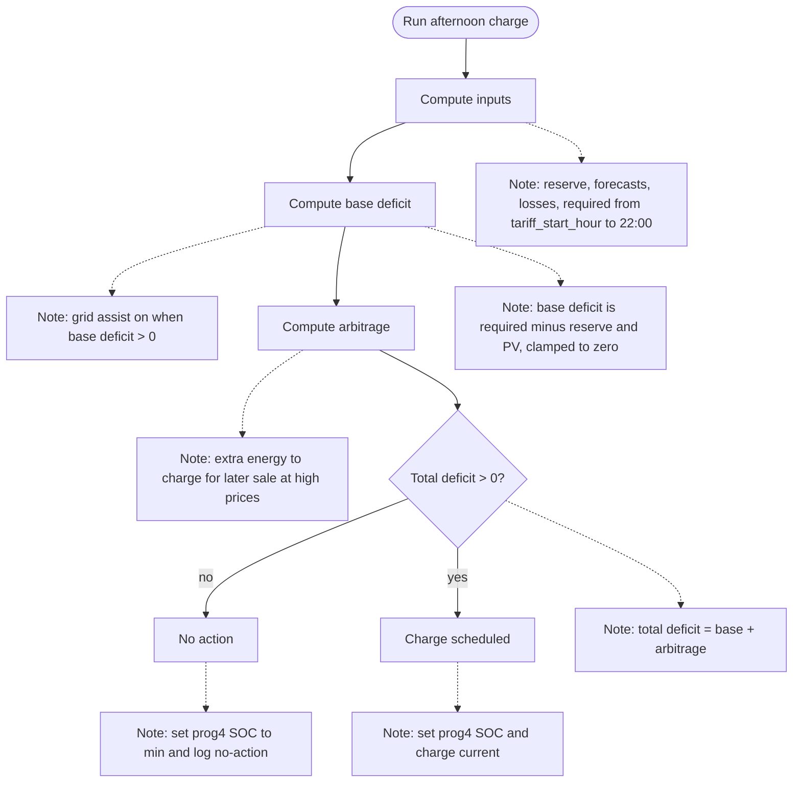

# Zachowanie popołudniowe (koniec taryfy) — Opis akcji

## Cel

Zapewnienie odpowiedniego poziomu energii w magazynie na wieczór i noc (do 22:00) poprzez planowanie ładowania z sieci po zakończeniu taryfy dziennej.

Arbitraż polega na dodatkowym doładowaniu magazynu w celu sprzedaży energii w szczycie cenowym. Arbitraż jest aktywowany tylko, gdy cena sprzedaży przekracza `min_arbitrage_price`.

## Wyzwalacz

- Godzina z sensora końca taryfy: `tariff_end_hour`
- Możliwość ręcznego wywołania przez dedykowany serwis (do ustalenia)

## Wejścia (koncepcyjne)

- Aktualny SOC baterii i dostępna pojemność magazynu
- Polityki SOC (limity minimalne/maksymalne)
- Docelowy SOC programu 4 (ładowanie z sieci)
- Przewidywane zużycie energii w oknie popołudniowym:
  - Zużycie domowe (z czujników w okienkach 4‑godzinnych)
  - Zużycie Pompy Ciepła (integracja zewnętrzna)
  - Zużycie CWU (integracja zewnętrzna) - tymczasowo niedostępne
- Przewidywana produkcja fotowoltaiczna (z integracją Solcast), z uwzględnieniem kompensacji prognozy na podstawie bieżącej produkcji (bez użycia współczynnika `pv_efficiency`)
- Współczynnik kompensacji PV (sensor: PV Forecast Compensation) — uśredniany z kompensacją „dzisiejszą”
- `min_arbitrage_price` (PLN/kWh) – próg opłacalności arbitrażu
- `pv_production_sensor` – rzeczywista produkcja PV do tej pory (kWh)
- `pv_forecast_today` i `pv_forecast_remaining` – do urealnienia prognozy (na potrzeby arbitrażu)
- `sell_window_price` – cena sprzedaży (warunek arbitrażu)
- Straty dzienne falownika
- Sprawność magazynu (domyślnie 90%):
   - przy wyznaczaniu rezerwy uwzględnia straty **tylko na rozładowaniu**
   - przy wyznaczaniu energii do załadowania uwzględnia straty **na ładowaniu i rozładowaniu**
- Margines bezpieczeństwa (domyślnie 1.1 = +10%)
- Sensor godziny startu taryfy: `tariff_start_hour` **(nowy, wymagany do okna obliczeń)**
- Sensor godziny końca taryfy: `tariff_end_hour` (wyzwalacz akcji)
- Ustawienie włączenia Pompy Ciepła (jeśli wyłączone, zużycie PC = 0)
- Sensor wsparcia z sieci po południu (afternoon grid assist)

## Przebieg decyzji (wysoki poziom)

1. **Walidacja konfiguracji**: Sprawdź czy wszystkie wymagane sensory są skonfigurowane i dostępne
2. **Obliczenie rezerwy energii**: Ile energii użytecznej jest obecnie w magazynie (ponad minimalny SOC)
3. **Obliczenie zapotrzebowania**: Ile energii będzie potrzebne w oknie `tariff_start_hour` → 22:00
   - Suma zużycia domowego z czujników
   - Zapytanie serwisu `heat_pump_predictor.calculate_forecast_energy` o zużycie Pompy Ciepła
   - Dodanie strat falownika proporcjonalnie do czasu (straty_dzienne / 24 × liczba_godzin) **z marginesem**
   - Korekta na margines bezpieczeństwa
4. **Obliczenie produkcji PV**: Suma prognozy PV z integracji Solcast dla okna `tariff_start_hour` → 22:00, z kompensacją prognozy (bez użycia `pv_efficiency`)
5. **Porównanie zapotrzebowanie vs dostępne źródła**:
   - Jeśli **rezerwa + prognoza PV >= zapotrzebowanie**: Brak akcji, energia wystarczy
   - Jeśli **deficyt > 0**: Oblicz ile energii załadować uwzględniając sprawność magazynu i zaplanuj doładowanie
6. **Arbitraż (po wyznaczeniu deficytu)**:
    - Jeśli `sell_price <= min_arbitrage_price` → brak arbitrażu
    - Urealnij prognozę PV:
       - `forecast_adjusted = pv_forecast_today * pv_production / (pv_forecast_today - pv_forecast_remaining)`
       - Jeśli mianownik <= 0 lub brak danych → brak arbitrażu
    - Wylicz bufor nadwyżek PV do okna sprzedaży:
       - `surplus_kwh = sum(max(pv_forecast[h] - load_forecast[h], 0))` dla godzin od teraz do startu okna sprzedaży
    - Oblicz wolne miejsce po ładowaniu podstawowym:
       - `free_after = capacity_kwh - (current_energy_kwh + required_kwh)`
    - Limit arbitrażu:
       - `arb_limit = max(free_after - surplus_kwh, 0)`
       - `arb_kwh = min(arb_limit, forecast_adjusted)`
    - Jeśli `arb_kwh > 0` → dodaj do planu ładowania

## Diagram (Mermaid)

### Szczegóły decyzyjne

**Algorytm obliczania deficytu:**
1. Bazowe zapotrzebowanie = zużycie_domowe + zużycie_PC
2. Zapotrzebowanie skorygowane = bazowe × margines_bezpieczeństwa (1.1)
3. Zapotrzebowanie całkowite = skorygowane + straty_falownika (również z marginesem)
4. Deficyt przed sprawnością = zapotrzebowanie_całkowite - rezerwa - prognoza_PV
5. Deficyt do załadowania = deficyt / sprawność (np. 15.4 / 0.9 = 17.1 kWh)

**Sprawność magazynu**:
- Dla rezerwy (energia dostępna z magazynu): jeśli w magazynie jest 1 kWh, rozładuję 0.9 kWh → uwzględniamy **tylko** straty rozładowania.
- Dla energii do załadowania: aby uzyskać wymaganą energię po rozładowaniu, trzeba załadować więcej z uwzględnieniem strat ładowania i rozładowania, np. `wymagane / (0.9 × 0.9)`.

**Prognoza PV**: Suma prognozy z `detailedForecast` liczona dla okna `tariff_start_hour` → 22:00, z kompensacją prognozy (średnia z kompensacji „dzisiejszej” i z sensora PV Forecast Compensation, bez użycia `pv_efficiency`).

### Arbitraż – wzory i ograniczenia

- **Warunek aktywacji**: `sell_price > min_arbitrage_price`.
- **Urealniona prognoza PV**:
   - `forecast_adjusted = pv_forecast_today * pv_production / (pv_forecast_today - pv_forecast_remaining)`
- **Bufor** (nadwyżka PV do okna sprzedaży):
   - `surplus_kwh = sum(max(pv_forecast[h] - load_forecast[h], 0))` od bieżącej godziny do startu okna sprzedaży
- **Wolne miejsce po ładowaniu podstawowym**:
   - `free_after = capacity_kwh - (current_energy_kwh + required_kwh)`
- **Limit arbitrażu**:
   - `arb_limit = max(free_after - surplus_kwh, 0)`
   - `arb_kwh = min(arb_limit, forecast_adjusted)`

**Obliczanie prądu ładowania**: jak w porannym scenariuszu (algorytm wielofazowy z limitami prądu).

## Wpływ na maszynę stanów

- NORMAL → CHARGING_FROM_GRID, gdy wymagane jest ładowanie magazynu z sieci

## Efekty sterowania (koncepcyjne)

- Ustaw docelowy SOC programu 2 (ładowanie z sieci) na obliczoną wartość
- Ustaw docelowy SOC programu 4 (ładowanie z sieci) na obliczoną wartość
- Ustaw prąd ładowania z sieci na obliczoną wartość (okno do 22:00)
- Uwzględnij arbitraż: docelowy SOC i prąd ładowania bazują na `required_kwh + arb_kwh`
- Falownik automatycznie rozpocznie ładowanie do osiągnięcia docelowego SOC
- Stan wsparcia z sieci po południu jest ustawiany na podstawie bazowego deficytu (bez arbitrażu)
- Jeśli brak deficytu (po arbitrażu), program 4 SOC jest przywracany do minimalnego SOC

## Obsługa błędów

**UWAGA**: Do ustalenia w przyszłości.

Należy określić zachowanie systemu w przypadku:
- Sensor `tariff_start_hour` jest niedostępny lub ma nieprawidłową wartość
- Serwis `heat_pump_predictor.calculate_forecast_energy` nie odpowiada lub zwraca błąd
- Sensor PV forecast jest niedostępny lub brak atrybutu prognozy
- Brak/nieprawidłowe dane `pv_production_sensor`, `pv_forecast_today`, `pv_forecast_remaining` (arbitraż pominięty)

Możliwe strategie:
- Użycie wartości domyślnych/historycznych
- Pominięcie akcji ładowania (bezpieczne podejście)
- Zalogowanie ostrzeżenia i kontynuacja z częściowymi danymi

## Logowanie i powiadomienia

- Zaloguj typ decyzji: brak akcji / ładowanie zaplanowane
- Zapisz kluczowe wejścia (rezerwa, zapotrzebowanie, deficyt, prognoza PV, docelowy SOC, prąd ładowania)
- Zapisz parametry arbitrażu: `arb_kwh`, `forecast_adjusted`, `surplus_kwh`, powód braku arbitrażu (np. cena poniżej progu, brak danych, `arb_limit <= 0`)
- Podaj krótkie uzasadnienie widoczne dla użytkownika
- Użyj ujednoliconego systemu logowania `log_decision_unified` z pełnym kontekstem
