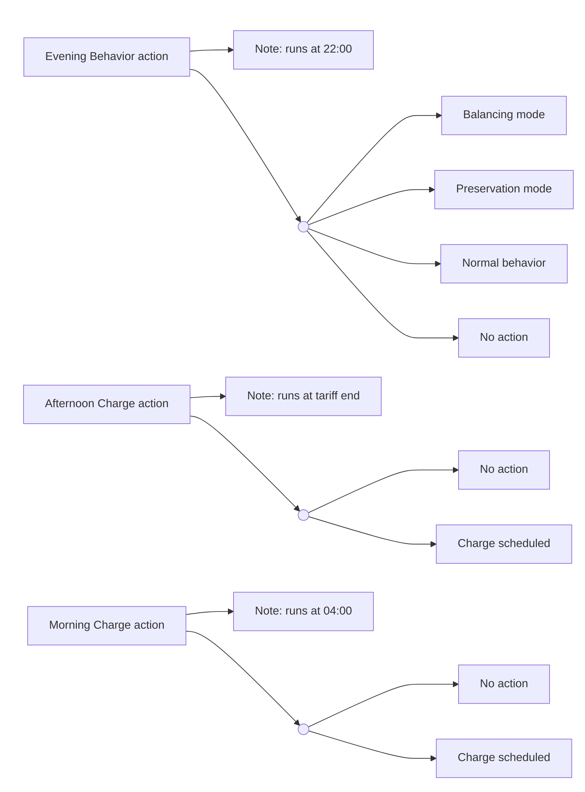

# Decision Engine Diagrams (Control File)

This file provides a high-level view of decision engine actions and their possible outcomes. Detailed flowcharts live in the action docs.

## High-Level Outcomes

## Detailed Diagrams

- Morning: [docs/Morning_Charge_Action.md](docs/Morning_Charge_Action.md)
- Afternoon: [docs/Afternoon_Charge_Action.md](docs/Afternoon_Charge_Action.md)
- Evening: [docs/Evening_Behavior_Action.md](docs/Evening_Behavior_Action.md)
