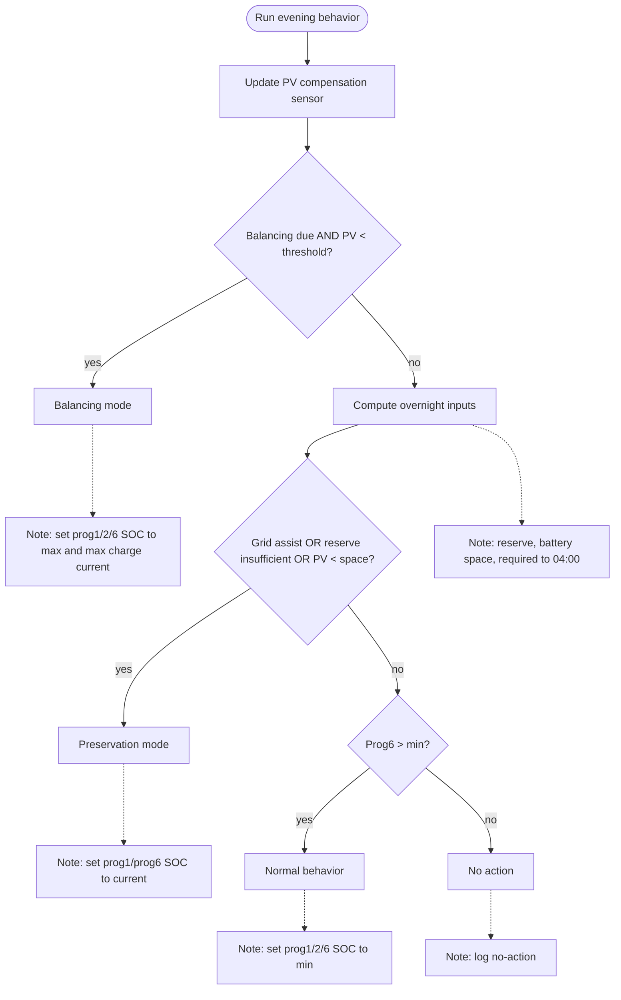

# Zachowanie wieczorne (22:00) — Opis akcji

## Cel

Zapobieganie nieefektywnemu rozładowaniu magazynu w nocy oraz wymuszenie pełnego balansowania, gdy jest wymagane.

## Wyzwalacz

- Stała godzina harmonogramu: 22:00

## Wejścia (koncepcyjne)

- Liczba dni od ostatniego balansowania (sensor last_balancing)
- Interwał balansowania (`balancing_interval_days`)
- Próg PV dla balansowania (`balancing_pv_threshold`)
- Prognoza PV na jutro
- Aktualna prognoza PV i bieżąca produkcja PV (do aktualizacji sensora kompensacji)
- Aktualny SOC i dostępna pojemność
- Polityki SOC (limity minimalne/maksymalne)
- Przewidywane zapotrzebowanie na energię elektryczną (20:00–04:00)
- Flaga wsparcia sieci po południu (afternoon grid assist)
- Encje prog1/prog2/prog6 SOC oraz max charge current

## Przebieg decyzji (wysoki poziom)

1. **Aktualizacja sensora kompensacji PV**: Przepisz wartości „dzisiaj” do „wczoraj”, zapisz bieżącą prognozę i produkcję PV jako „dzisiaj”, zaktualizuj wartość sensora.
2. **Sprawdzenie balansowania**: Balansowanie jest wymagane, jeśli brak ostatniego balansu lub minął interwał dni oraz prognoza PV na jutro jest poniżej progu.
3. **Balansowanie wymagane**: Ustaw cel 100% SOC na noc (programy 1/2/6) oraz maksymalny prąd ładowania; ustaw flagę „balancing ongoing”.
4. **Balansowanie niewymagane**: Oblicz rezerwę i zapotrzebowanie do 04:00 (20:00–24:00 oraz 00:00–04:00) z uwzględnieniem strat i marginesu. Wyznacz przestrzeń magazynu oraz prognozę PV z efektywnością 0.9.
5. **Tryb ochrony (preservation)**: Jeśli włączone wsparcie z sieci po południu **lub** rezerwa jest niewystarczająca **lub** prognoza PV < przestrzeń magazynu, zamroź SOC (programy 1 i 6 na bieżący SOC).
6. **Tryb normalny**: Jeśli brak przesłanek do ochrony i program 6 jest powyżej minimalnego SOC, przywróć normalny minimalny SOC (programy 1/2/6).

## Diagram (Mermaid)

### Szczegóły decyzyjne
1. **Balansowanie**: aktywne, gdy `days_since_balancing >= balancing_interval_days` (lub brak last_balancing) oraz `pv_forecast_tomorrow < balancing_pv_threshold`.
2. **Preservation**: aktywne, gdy `afternoon_grid_assist = True` **lub** `reserve_kwh < required_to_04` **lub** `pv_forecast_tomorrow × 0.9 < battery_space`.
3. **Normal**: aktywne, gdy preservation nie jest wymagane i program 6 ma SOC powyżej minimalnego.

## Wpływ na maszynę stanów

- NORMAL → BALANCING, gdy balansowanie jest wymagane (flaga balansowania ustawiona + warunki czasowe lub prognozy PV).
- NORMAL → RUNNING_FROM_GRID, gdy wymagane jest zamrożenie SOC w celu uniknięcia rozładowania.
- BALANCING → NORMAL po osiągnięciu docelowego SOC (lub po porannym cut-off).
- RUNNING_FROM_GRID → NORMAL po porannym cut-off.

## Efekty sterowania (koncepcyjne)

- Ustaw tryb pracy falownika pod bezpieczne zachowanie nocne.
- Ustaw cele SOC programów dla balansowania (program 6 oraz odzwierciedlony program 1, jeśli potrzebne).
- Włącz lub wyłącz ładowanie z sieci zgodnie z decyzją.
- Przy zamrożeniu SOC ustaw minimalny SOC równy bieżącemu SOC, aby zablokować rozładowanie.

## Logowanie i powiadomienia

- Zaloguj typ decyzji: balansowanie / praca z sieci / normalny.
- Zapisz kluczowe wejścia (dni od ostatniego balansowania, prognoza PV, SOC).
- Podaj krótkie uzasadnienie widoczne dla użytkownika.
