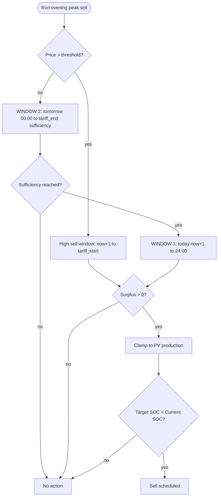

# Sprzedaż w szczycie wieczornym — Opis akcji

## Cel

Zarządzanie sprzedażą energii z magazynu wieczorem w dwóch trybach:

- **`high_sell`**: klasyczny arbitraż cenowy, gdy cena wieczorna jest powyżej progu.
- **`sell` (surplus sell)**: sprzedaż nadwyżki, gdy cena nie przekracza progu, ale bateria ma realną nadwyżkę po pokryciu zapotrzebowania do jutrzejszej godziny wystarczalności PV.

## Wyzwalacz

- Godzina z sensora wieczornego szczytu cenowego: `evening_max_price_hour_sensor` (domyślnie 17:00)
- Możliwość ręcznego wywołania przez serwis `energy_optimizer.evening_peak_sell`

## Wejścia (koncepcyjne)

- Aktualny SOC baterii i parametry magazynu (pojemność, napięcie, sprawność)
- Polityki SOC (limity minimalne/maksymalne)
- Docelowy SOC programu 5 (rozładowanie do sieci)
- Cena wieczornego szczytu (`evening_max_price_sensor`)
- Minimalna cena arbitrażu (`min_arbitrage_price`, PLN/MWh)
- Przewidywane zużycie energii w oknie od teraz+1h do startu taryfy niskiej:
  - Zużycie domowe (z czujników w okienkach 4-godzinnych)
  - Zużycie Pompy Ciepła (integracja zewnętrzna)
- Przewidywana produkcja PV (Solcast) z kompensacją prognozy (bez `pv_efficiency`)
- Rzeczywista produkcja PV (`pv_production_sensor`) do ograniczenia nadwyżki
- Straty dzienne falownika
- Margines bezpieczeństwa (domyślnie 1.1 = +10%)
- Sensor godziny startu taryfy niskiej: `tariff_start_hour` (domyślnie 22:00)
- Encja trybu pracy falownika (`work_mode_entity`)
- Encja limitu mocy eksportu (`export_power_entity`)
- Tryb testowy sprzedaży (`test_sell_mode`)

## Przebieg decyzji (wysoki poziom)

1. **Rozgałęzienie po cenie**:
   - `evening_price > min_arbitrage_price` → gałąź **`high_sell`**,
   - `evening_price <= min_arbitrage_price` → gałąź **`surplus sell`**.

### Gałąź 1: `high_sell` (cena > threshold)

1. Obliczenie rezerwy energii powyżej min SOC.
2. Obliczenie zapotrzebowania od `now+1h` do `tariff_start_hour` (zużycie + HP + straty, z marginesem).
3. Obliczenie PV forecast dla tego samego okna.
4. Nadwyżka: `max(0, rezerwa + PV - zapotrzebowanie)`.
5. Clamp do dzisiejszej produkcji PV (`pv_production_sensor`).
6. Wyliczenie `target_soc`, `export_power` i zapis do falownika (poza test mode).

### Gałąź 2: `sell` (surplus sell, cena <= threshold)

Algorytm two-window z granicą na północy:

1. **OKNO 2 (najpierw):** `00:00 -> tariff_end` (jutro) i `calculate_sufficiency_window(...)`.
   - Jeśli `sufficiency_reached = False` → **`no_action`**.
   - `tomorrow_net = max(0, required_to_suff - pv_to_suff)`.
2. **OKNO 1:** `now+1 -> 24:00` (dzisiaj).
   - `today_net = max(0, today_demand - today_pv)`.
3. `total_needed = today_net + tomorrow_net`.
4. `surplus = max(0, reserve_kwh - total_needed)`.
   - Jeśli `surplus <= 0` → **`no_action`**.
5. Clamp do dzisiejszej produkcji PV, wyliczenie `target_soc` i `export_power`, zapis do falownika (poza test mode).

## Diagram (Mermaid)

### Szczegóły decyzyjne

**`high_sell`:**

- Okno: `(bieżąca_godzina + 1) -> tariff_start_hour`.
- Nadwyżka: `max(0, rezerwa + prognoza_PV - zapotrzebowanie)`.
- `action_type`: `high_sell`.

**`surplus sell`:**

- OKNO 2: `00:00 -> tariff_end`, z wyznaczeniem jutrzejszej godziny wystarczalności PV.
- OKNO 1: `now+1 -> 24:00`, bilans dzisiejszego wieczoru.
- Nadwyżka: `max(0, reserve_kwh - (today_net + tomorrow_net))`.
- `action_type`: `sell`.

**Ograniczenie nadwyżki do produkcji PV:**
- Jeśli dostępny `pv_production_sensor` i nadwyżka przekracza dzisiejszą produkcję PV, nadwyżka jest ograniczana.
- Celem jest uniknięcie sprzedaży energii, która mogła pochodzić z ładowania z sieci.

**Docelowy SOC:**
- `target_soc = max(current_soc - kwh_to_soc(nadwyżka), min_soc)`.
- W zapisie do encji SOC wartość jest zaokrąglana w górę do pełnego procenta.

**Moc eksportu:**
- Formuła: `round((nadwyżka × 1000 + 250) / 100) × 100` W.
- Minimum: 100 W.

## Wpływ na maszynę stanów

- NORMAL → SELLING_TO_GRID dla obu gałęzi (`high_sell` i `sell`), gdy aktywowany jest eksport energii (`Export First`) i ustawiony docelowy SOC programu 5.

## Efekty sterowania (koncepcyjne)

- Ustawienie trybu pracy falownika na `Export First`
- Ustawienie docelowego SOC programu 5
- Ustawienie limitu mocy eksportu
- W trybie testowym (`test_sell_mode`) wyłącznie logowanie decyzji bez zapisu do falownika

## Obsługa błędów

**Aktualny stan (implementacja):**
- Brak ceny wieczornej → brak akcji i log z powodem
- Cena wieczorna poniżej progu arbitrażu:
   - nie kończy od razu,
   - uruchamia gałąź `surplus sell`
- W `surplus sell`: brak osiągnięcia godziny wystarczalności jutro → brak akcji
- W `surplus sell`: brak nadwyżki (`reserve <= total_needed`) → brak akcji
- Brak wymaganych encji SOC → zakończenie na etapie walidacji wejścia
- Brak `tariff_start_hour` → fallback do 22:00
- Brak prognozy PV/HP lub strat → przyjmowane wartości 0 zgodnie z helperami
- Brak `pv_production_sensor` → pominięcie kroku ograniczania nadwyżki

## Logowanie i powiadomienia

- Zaloguj typ decyzji: `high_sell` / `sell` / `no_action`
- Zaloguj kluczowe parametry: `current_soc`, `target_soc`, `surplus_kwh`, `export_power_w`, cena i próg
- Dla `high_sell`: `reserve_kwh`, `required_kwh`, `pv_forecast_kwh`, `heat_pump_kwh`, `losses_kwh`, okno godzinowe
- Dla `surplus sell`: `today_net_kwh`, `tomorrow_net_kwh`, `total_needed_kwh`, `sufficiency_hour`
- Dodaj informację o `test_sell_mode`
- Użyj ujednoliconego systemu logowania `log_decision_unified`
