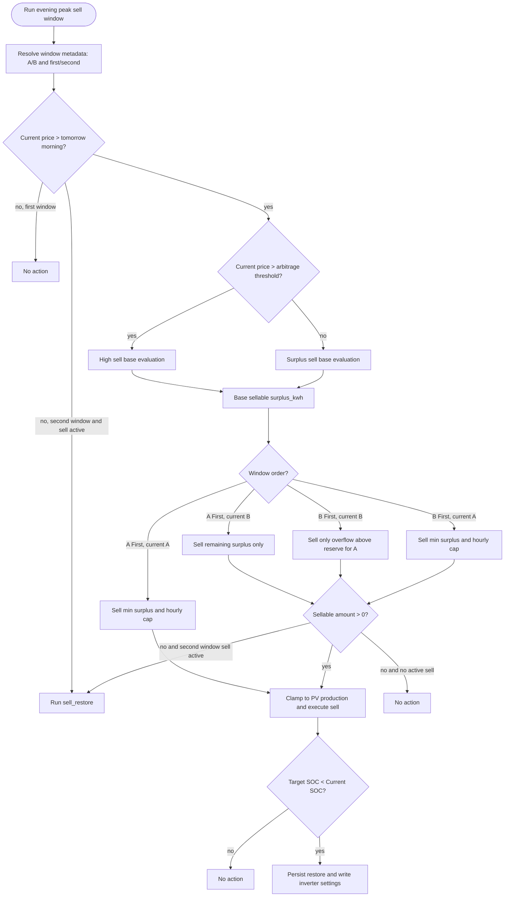

# Sprzedaż w szczycie wieczornym — Opis akcji

## Cel

Zarządzanie sprzedażą energii z magazynu wieczorem z użyciem dwóch okien sprzedaży:

- **okno `A`** — wyższa cena wieczorna,
- **okno `B`** — niższa cena wieczorna.

Logika działa niezależnie od kolejności czasowej okien (`A First` albo `B First`) i dla każdego wywołania rozstrzyga:

- czy bieżące okno jest korzystniejsze niż cena jutrzejszego poranka,
- ile energii można sprzedać w jednej pełnej godzinie według `max_export_power`,
- czy sprzedaż ma zostać rozpoczęta, kontynuowana, czy zakończona przez `sell_restore`.

## Wyzwalacz

- Godzina głównego okna wieczornego `A`: `evening_max_price_hour_sensor` (domyślnie 17:00)
- Opcjonalna godzina drugiego okna `B`: `evening_second_max_price_hour_sensor`
- Możliwość ręcznego wywołania przez serwis `energy_optimizer.evening_peak_sell`

## Wejścia (koncepcyjne)

- Aktualny SOC baterii i parametry magazynu (pojemność, napięcie, sprawność)
- Polityki SOC (limity minimalne/maksymalne)
- Docelowy SOC programu 5 (rozładowanie do sieci)
- Cena okna `A` (`evening_max_price_sensor`)
- Cena okna `B` (`evening_second_max_price_sensor`), jeśli skonfigurowana
- Cena jutrzejszego porannego szczytu (`tomorrow_morning_max_price_sensor`)
- Minimalna cena arbitrażu (`min_arbitrage_price`, PLN/MWh)
- Przewidywane zużycie energii w oknie od teraz+1h do startu taryfy niskiej:
  - Zużycie domowe (z czujników w okienkach 4-godzinnych)
  - Zużycie Pompy Ciepła (integracja zewnętrzna)
- Przewidywana produkcja PV (Solcast) z kompensacją prognozy (bez `pv_efficiency`)
- Rzeczywista produkcja PV (`pv_production_sensor`) do ograniczenia nadwyżki
- Straty dzienne falownika
- Margines bezpieczeństwa (domyślnie 1.1 = +10%)
- Sensor godziny startu wysokiej taryfy: `high_tariff_start_hour_sensor` (domyślnie 22:00)
- Maksymalna moc eksportu falownika (`max_export_power`) — używana jako cap energii możliwej do sprzedaży w jednej pełnej godzinie:
   - `hourly_cap_kwh = max_export_power / 1000`
- Encja trybu pracy falownika (`work_mode_entity`)
- Encja limitu mocy eksportu (`export_power_entity`)
- Tryb testowy sprzedaży (`test_sell_mode`)

## Przebieg decyzji (wysoki poziom)

1. Scheduler uruchamia jedno lub dwa okna wieczorne, przekazując do logiki tylko metadane:
   - czy bieżące okno to `A` czy `B`,
   - czy jest to pierwsze czy drugie okno chronologicznie.
2. Logika sprzedaży dla każdego wywołania:
   - rozpoznaje bieżące okno (`A/B`) i jego pozycję (`first/second`),
   - porównuje bieżącą cenę z ceną jutrzejszego poranka,
   - oblicza bazowy `surplus_kwh`,
   - dzieli sprzedaż pomiędzy okna zgodnie z regułami `A First` / `B First`,
   - w drugim oknie może aktywnie zakończyć sprzedaż przez `sell_restore`.

### Wspólne reguły

1. **Wczesne wyjście względem ceny jutro rano**
   - Jeśli cena bieżącego okna nie jest wyższa niż cena jutro rano:
     - w **pierwszym** oknie → `no_action`,
     - w **drugim** oknie, jeśli sprzedaż jest aktywna → `sell_restore`.

2. **Bazowe wyliczenie nadwyżki**
   - Gdy `current_window_price > min_arbitrage_price` używana jest ścieżka `high_sell`.
   - Gdy `current_window_price <= min_arbitrage_price` używana jest ścieżka `sell` (surplus sell).

3. **Cap jednej godziny sprzedaży**
   - `hourly_cap_kwh = max_export_power / 1000`
   - To ograniczenie służy do podziału energii między okna `A` i `B`.

### Reguły podziału energii między okna

#### `A First`

- W pierwszym oknie `A` sprzedawane jest:
  - `min(surplus_kwh, hourly_cap_kwh)`
- W drugim oknie `B` sprzedawana jest tylko pozostałość.
- Jeśli w drugim oknie nie ma już nadwyżki, a sprzedaż jest aktywna, uruchamiany jest `sell_restore`.
- Jeśli `B` nie jest korzystniejsze niż jutro rano, `B` nie kontynuuje sprzedaży i przy aktywnej sprzedaży następuje `sell_restore`.

#### `B First`

- W pierwszym oknie `B` zachowywana jest energia na późniejsze lepsze okno `A`:
  - `reserved_for_A = min(surplus_kwh, hourly_cap_kwh)`
  - `overflow_for_B = max(0, surplus_kwh - reserved_for_A)`
- `B` sprzedaje tylko `overflow_for_B`.
- Późniejsze okno `A` sprzedaje:
  - `min(surplus_kwh, hourly_cap_kwh)`
- Jeśli w późniejszym `A` nie ma już nic do sprzedaży, a sprzedaż jest aktywna, uruchamiany jest `sell_restore`.

## Diagram (Mermaid)

```mermaid
flowchart TD
   ES_start([Run evening peak sell window]) --> ES_meta[Resolve window metadata: A/B and first/second]
   ES_meta --> ES_price{Current price > tomorrow morning?}

   ES_price -->|no, first window| ES_no_action[No action]
   ES_price -->|no, second window and sell active| ES_restore[Run sell_restore]
   ES_price -->|yes| ES_branch{Current price > arbitrage threshold?}

   ES_branch -->|yes| HP_inputs[High sell base evaluation]
   ES_branch -->|no| SP_window2[Surplus sell base evaluation]

   HP_inputs --> ES_base[Base sellable surplus_kwh]
   SP_window2 --> ES_base

   ES_base --> ES_order{Window order?}

   ES_order -->|A First, current A| A1[Sell min surplus and hourly cap]
   ES_order -->|A First, current B| A2[Sell remaining surplus only]
   ES_order -->|B First, current B| B1[Sell only overflow above reserve for A]
   ES_order -->|B First, current A| B2[Sell min surplus and hourly cap]

   A1 --> ES_exec
   A2 --> ES_second{Sellable amount > 0?}
   B1 --> ES_second
   B2 --> ES_second

   ES_second -->|no and second window sell active| ES_restore
   ES_second -->|no and no active sell| ES_no_action2[No action]
   ES_second -->|yes| ES_exec[Clamp to PV production and execute sell]

   ES_exec --> ES_target{Target SOC < Current SOC?}
   ES_target -->|no| ES_no_action3[No action]
   ES_target -->|yes| ES_sell[Persist restore and write inverter settings]
```

### Szczegóły decyzyjne

**`high_sell`:**

- Okno bazowe: `(bieżąca_godzina + 1) -> tariff_start_hour`.
- Nadwyżka bazowa: `max(0, rezerwa + prognoza_PV - zapotrzebowanie)`.
- Po obliczeniu nadwyżki stosowany jest podział `A/B` według `A First` / `B First`.
- `action_type`: `high_sell`.

**`surplus sell`:**

- OKNO 2: `00:00 -> tariff_end`, z wyznaczeniem jutrzejszej godziny wystarczalności PV.
- OKNO 1: `now+1 -> 24:00`, bilans dzisiejszego wieczoru.
- Nadwyżka bazowa: `max(0, reserve_kwh - (today_net + tomorrow_net))`.
- Po obliczeniu nadwyżki stosowany jest podział `A/B` według `A First` / `B First`.
- `action_type`: `sell`.

**Ograniczenie nadwyżki do produkcji PV:**
- Jeśli dostępny `pv_production_sensor` i nadwyżka przekracza dzisiejszą produkcję PV, nadwyżka jest ograniczana.
- Celem jest uniknięcie sprzedaży energii, która mogła pochodzić z ładowania z sieci.

**Podział energii między okna:**
- `A First`:
   - `A = min(surplus_kwh, hourly_cap_kwh)`
   - `B = pozostałość`, jeśli nadal opłacalna względem jutra rano
- `B First`:
   - `B = max(0, surplus_kwh - min(surplus_kwh, hourly_cap_kwh))`
   - `A = min(surplus_kwh, hourly_cap_kwh)`

**Zatrzymanie sprzedaży w drugim oknie:**
- Jeśli drugie okno nie ma już korzystnej ceny lub nie ma sellable surplus, a sprzedaż jest aktywna, wywoływany jest `sell_restore`.

**Docelowy SOC:**
- `target_soc = max(current_soc - kwh_to_soc(nadwyżka), min_soc)`.
- W zapisie do encji SOC wartość jest zaokrąglana w górę do pełnego procenta.

**Moc eksportu:**
- Formuła: `round((nadwyżka × 1000 + 250) / 100) × 100` W.
- Minimum: 100 W.

## Wpływ na maszynę stanów

- `NORMAL → SELLING_TO_GRID`, gdy bieżące okno uruchamia sprzedaż (`Export First` + docelowy SOC programu 5).
- `SELLING_TO_GRID → NORMAL`, gdy drugie okno wywoła `sell_restore` albo gdy zadziała fallback restore z harmonogramu.

## Efekty sterowania (koncepcyjne)

- Ustawienie trybu pracy falownika na `Export First`
- Ustawienie docelowego SOC programu 5
- Ustawienie limitu mocy eksportu dla wyliczonej ilości energii w danym oknie
- Wywołanie `sell_restore`, gdy drugie okno kończy aktywną sprzedaż
- W trybie testowym (`test_sell_mode`) wyłącznie logowanie decyzji bez zapisu do falownika

## Obsługa błędów

**Aktualny stan (implementacja):**
- Brak ceny bieżącego okna → fallback do gałęzi `surplus sell`
- Cena bieżącego okna poniżej progu arbitrażu:
   - nie kończy od razu,
   - uruchamia gałąź `surplus sell`
- Cena bieżącego okna nie wyższa niż cena jutro rano:
   - w pierwszym oknie → `no_action`
   - w drugim oknie przy aktywnej sprzedaży → `sell_restore`
- W `surplus sell`: brak osiągnięcia godziny wystarczalności jutro → brak akcji
- W `surplus sell`: brak nadwyżki (`reserve <= total_needed`) → brak akcji lub `sell_restore` w drugim oknie przy aktywnej sprzedaży
- Brak wymaganych encji SOC → zakończenie na etapie walidacji wejścia
- Brak `high_tariff_start_hour_sensor` → fallback do 22:00
- Brak prognozy PV/HP lub strat → przyjmowane wartości 0 zgodnie z helperami
- Brak `pv_production_sensor` → pominięcie kroku ograniczania nadwyżki

## Logowanie i powiadomienia

- Zaloguj typ decyzji: `high_sell` / `sell` / `no_action` / `sell_restore`
- Zaloguj metadane okna: `A/B`, `first/second`, godzina bieżącego okna
- Zaloguj kluczowe parametry: `current_soc`, `target_soc`, `surplus_kwh`, `export_power_w`, cena bieżącego okna, cena jutro rano i próg arbitrażu
- Dla `high_sell`: `reserve_kwh`, `required_kwh`, `pv_forecast_kwh`, `heat_pump_kwh`, `losses_kwh`, okno godzinowe
- Dla `surplus sell`: `today_net_kwh`, `tomorrow_net_kwh`, `total_needed_kwh`, `sufficiency_hour`
- Zaloguj `hourly_cap_kwh` oraz ilość energii przydzieloną bieżącemu oknu
- Dodaj informację o `test_sell_mode`
- Użyj ujednoliconego systemu logowania `log_decision_unified`
