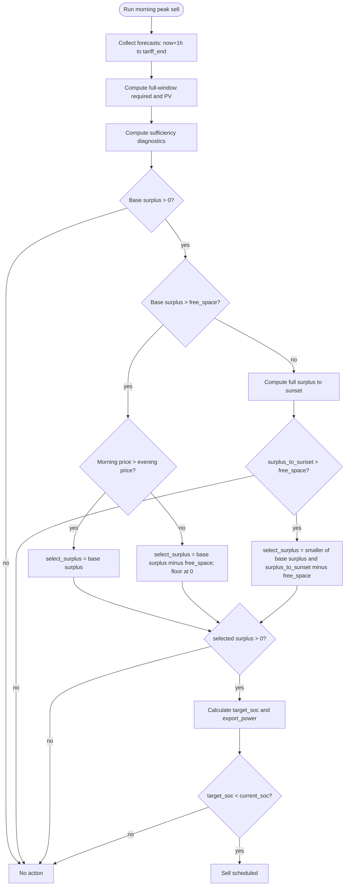

# Sprzedaż w szczycie porannym — Opis akcji

## Cel

Sprzedaż nadwyżki energii z magazynu w oknie porannego szczytu cenowego, gdy bateria dysponuje
energią powyżej poziomu niezbędnego do pokrycia zapotrzebowania w pełnym horyzoncie porannym
oraz (w gałęzi pomocniczej) do zachodu słońca.

Akcja operuje jedną główną ścieżką nadwyżki, ale zawiera rozgałęzienie decyzyjne po relacji ceny
porannej do wieczornej oraz bramki pojemności (`free_space_kwh` i `surplus_to_sunset_kwh`).
Sprzedaż następuje tylko przy dodatnim `selected_surplus_kwh` i możliwości obniżenia SOC.

## Wyzwalacz

- Godzina z sensora porannego szczytu cenowego: `morning_max_price_hour_sensor` (domyślnie 07:00)
- Możliwość ręcznego wywołania przez serwis `energy_optimizer.morning_peak_sell`

## Wejścia (koncepcyjne)

- Aktualny SOC baterii i parametry magazynu (pojemność, napięcie, sprawność)
- Polityki SOC (limity minimalne/maksymalne)
- Docelowy SOC programu 3 (rozładowanie do sieci)
- Cena porannego szczytu (`morning_max_price_sensor`)
- Minimalna cena arbitrażu (`min_arbitrage_price`, PLN/MWh) — **logowana, nie blokuje** akcji
- Przewidywane zużycie energii w oknie od teraz+1h do końca taryfy dziennej:
  - Zużycie domowe (z czujników w okienkach 4-godzinnych)
  - Zużycie Pompy Ciepła (integracja zewnętrzna)
- Przewidywana produkcja PV (Solcast) z efektywnością PV (w tej akcji bez kompensacji prognozy)
- Straty dzienne falownika
- Margines bezpieczeństwa (domyślnie 1.1 = +10%)
- Sensor godziny końca taryfy dziennej: `tariff_end_hour_sensor` (domyślnie 13:00)
- Encja trybu pracy falownika (`work_mode_entity`)
- Encja limitu mocy eksportu (`export_power_entity`)
- Tryb testowy sprzedaży (`test_sell_mode`)

## Przebieg decyzji (wysoki poziom)

1. **Walidacja wejść**: SOC baterii i encja Prog3 SOC muszą być dostępne; brak ceny porannej → wyjście bez akcji.
2. **Obliczenie okna**: `start = now+1h`, `end = tariff_end_hour`.
3. **Zebranie prognoz**: zużycie domowe, HP, PV (z efektywnością, bez kompensacji), straty — dla okna godzinowego.
4. **Obliczenie nadwyżki bazowej (pełne okno)**:
  - `required_kwh` liczony jest dla pełnego okna `now+1h -> tariff_end_hour`.
  - `pv_forecast_kwh` liczony jest dla pełnego tego samego okna.
  - `surplus_kwh = max(reserve_kwh + pv_forecast_kwh - required_kwh, 0)`.
5. **Sufficiency jako diagnostyka/safety**:
  - wyznaczane są `sufficiency_hour`, `sufficiency_reached`, `required_sufficiency_kwh`, `pv_sufficiency_kwh`.
  - wartości sufficiency nie zastępują bazowego `required_kwh`/`pv_forecast_kwh` dla decyzji sell.
6. **Gałąź free-space i ceny**:
  - jeśli `surplus_kwh > free_space_kwh` i `morning_price > evening_price` → sprzedaż pełnego `surplus_kwh`.
  - jeśli `surplus_kwh > free_space_kwh` i `morning_price <= evening_price` → sprzedaż overflow:
    `selected_surplus_kwh = max(surplus_kwh - free_space_kwh, 0)`.
7. **Gałąź do zachodu (gdy `surplus_kwh <= free_space_kwh` lub `price_unavailable = true`)**:
  - liczony jest pełny `surplus_to_sunset_kwh` dla okna `now+1h -> sunset`.
  - gdy `surplus_to_sunset_kwh > free_space_kwh`, sprzedaj:
    `min(surplus_kwh, surplus_to_sunset_kwh - free_space_kwh)`.
8. **Brak dodatniego `selected_surplus_kwh`** → `no_action`.
9. **Obliczenie target SOC** i sterowanie falownikiem jak dotychczas.

## Diagram (Mermaid)

### Szczegóły decyzyjne

**Model Sufficiency Window (diagnostyka/safety):**

Algorytm wyznacza punkt, od którego PV samo pokrywa godzinowe zapotrzebowanie,
ale traktuje te metryki jako diagnostykę i kontekst bezpieczeństwa:

1. Dla każdej godziny `h` w oknie oblicz: `demand[h] = (usage[h] + hp[h] + losses_hourly) × margin`.
2. Znajdź pierwszą godzinę `sufficiency_hour`, dla której `pv_forecast[h] >= demand[h]`.
3. Jeśli `sufficiency_reached`:
  - `required_sufficiency_kwh = Σ demand[h]` dla `h < sufficiency_hour`
  - `pv_sufficiency_kwh = Σ pv_forecast[h]` dla `h < sufficiency_hour`
4. Bazowe `required_kwh` i `pv_forecast_kwh` dla decyzji sell pozostają pełnymi sumami okna.

Cel modelu: pokazać moment samowystarczalności PV oraz kontekst bezpieczeństwa,
bez zaniżania metryk sprzedażowych pełnego horyzontu.

**Nadwyżka energii:**
- Formula: `surplus_kwh = max(reserve_kwh + pv_forecast_kwh - required_kwh, 0)`
- `reserve_kwh = (current_soc - min_soc) / 100 × capacity_ah × voltage / 1000 × efficiency`

**Gałąź overflow przy `surplus_kwh > free_space_kwh`:**
- Jeśli `morning_price > evening_price`: `selected_surplus_kwh = surplus_kwh`
- W przeciwnym razie: `selected_surplus_kwh = max(surplus_kwh - free_space_kwh, 0)`

**Brak clampu do produkcji PV:**
- W przeciwieństwie do akcji wieczornej, morning sell **nie ogranicza** nadwyżki do wartości
  `pv_production_sensor`. O poranku dzienna produkcja PV jeszcze nie jest miarodajnym wskaźnikiem.

**Brak kompensacji forecastu PV w morning sell:**
- Dla obu okien (bazowego i do zachodu) prognoza PV liczona jest z `apply_efficiency=True`
  oraz `compensate=False`.

**Rola ceny i progu arbitrażu:**
- Cena poranna (`morning_max_price_sensor`) jest **wymagana** — brak → wyjście bez akcji.
- `min_arbitrage_price` jest **logowany** do danych decyzji jako `threshold_price`.
- Cena **nie blokuje** sprzedaży — brak rozgałęzienia `price > threshold`.
- Brak ceny porannej nie przerywa akcji: uruchamiany jest fallback (`price_unavailable=true`) i
  decyzja przechodzi przez gałąź pojemności/sunset.
- Warunki aktywacji eksportu: `selected_surplus_kwh > 0` ORAZ `target_soc < current_soc`.

**Docelowy SOC:**
- Formula (wspólna baza sell):
  `target_soc = max(current_soc - kwh_to_soc(selected_surplus_kwh) - 5, target_soc_floor)`
- `target_soc_floor = min_soc_pv` gdy `sufficiency_reached=true`, w przeciwnym razie `min_soc`.
- Zaokrąglany w górę do pełnego procentu przed zapisem do encji.

**Moc eksportu:**
- Formula: `round((surplus_kwh × 1000 + 250) / 100) × 100` W.
- Minimum: 100 W.

**Godzina przywrócenia (restore_hour):**
- `restore_hour = (morning_max_price_hour + 1) % 24`
- Domyślnie: sell_hour = 7 → restore o 8:00.

## Wpływ na maszynę stanów

- NORMAL → SELLING_TO_GRID dla akcji `sell`, gdy aktywowany jest eksport energii (`Export First`)
  i ustawiony docelowy SOC programu 3.

## Efekty sterowania (koncepcyjne)

- Ustawienie trybu pracy falownika na `Export First`
- Zapis danych przywrócenia (`sell_restore`) do pamięci runtime i trwałego storage HA:
  - Oryginalny tryb pracy, encja i wartość Prog3 SOC, `restore_hour`, `sell_type = "morning"`
- Ustawienie docelowego SOC programu 3
- Ustawienie limitu mocy eksportu
- W trybie testowym (`test_sell_mode`) wyłącznie logowanie decyzji bez zapisu do falownika

## Obsługa błędów

- Brak SOC baterii lub encji Prog3 SOC → zakończenie na etapie walidacji wejścia
- Brak ceny porannej (`morning_max_price_sensor`) → fallback z `price_unavailable=true` i
  kontynuacja decyzji przez gałąź pojemności/sunset
- Brak `tariff_end_hour_sensor` → fallback do 13:00 (z logiem warning)
- Brak `morning_max_price_hour_sensor` → fallback do 7:00 (z logiem warning); restore_hour = 8
- Brak prognozy PV / serwisu HP / strat → przyjmowane wartości 0 zgodnie z helperami
- Nadwyżka = 0 → `no_action` z logiem powodu
- `target_soc >= current_soc` → `no_action` z logiem „target SOC does not require discharge"

## Logowanie i powiadomienia

- Zaloguj typ decyzji: `sell` / `no_action`
- Zaloguj kluczowe parametry: `current_soc`, `target_soc`, `surplus_kwh`, `export_power_w`,
  `morning_price`, `threshold_price`
- Zaloguj parametry okna: `start_hour`, `end_hour`, `reserve_kwh`, `required_kwh`,
  `pv_forecast_kwh`, `heat_pump_kwh`, `losses_kwh`
- Dodaj informacje o sufficiency: `sufficiency_hour`, `sufficiency_reached`,
  `required_sufficiency_kwh`, `pv_sufficiency_kwh`
- Dodaj pełne metryki horyzontu i selekcji: `base_required_kwh_full`,
  `base_pv_forecast_kwh_full`, `surplus_to_sunset_kwh`, `free_space_kwh`, `selected_surplus_kwh`
- Dodaj informację o `test_sell_mode`
- Użyj ujednoliconego systemu logowania `log_decision_unified`
