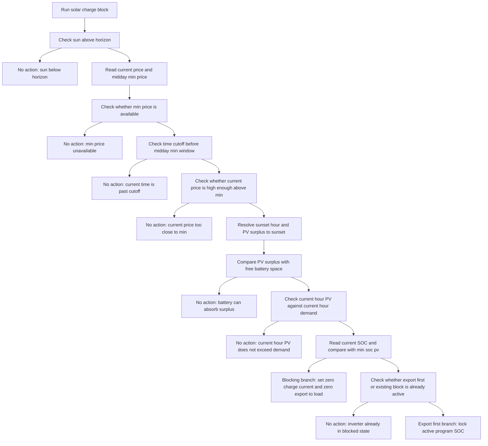

# Blokada ładowania z PV-surplus guardem — Opis akcji

## Cel

Zablokowanie ładowania magazynu z sieci w godzinach porannych i przedpołudniowych, gdy prognozowana nadwyżka produkcji PV może nie zmieścić się w dostępnej pojemności baterii.

Logika ma dwa praktyczne tryby działania:

- **`BLOCKING`** — gdy SOC jest niski lub równy progowi `min_soc_pv`; ładowanie zostaje zablokowane przez ustawienie `max_charge_current = 0`, a falownik pozostaje w trybie `Zero Export To Load`.
- **`EXPORT FIRST`** — gdy SOC jest już powyżej `min_soc_pv`; falownik przechodzi do trybu `Export First`, a docelowy SOC aktywnego programu jest blokowany na poziomie `min_soc_pv`.

Celem nie jest pełne wyłączenie wykorzystania PV, lecz pozostawienie miejsca w baterii na energię słoneczną i uniknięcie niepotrzebnego ładowania z sieci tuż przed spodziewaną produkcją.

## Wyzwalacz

- Harmonogram godzinowy aktywny tylko w ciągu dnia: `:01` każdej godziny, gdy `sun.sun` jest `above_horizon`
- Listener aktywowany o wschodzie słońca przez scheduler
- Listener zatrzymywany o zachodzie słońca przez scheduler
- Przy starcie integracji w trakcie dnia: listener uruchamiany od razu, jeśli słońce jest nad horyzontem
- Możliwość ręcznego wywołania przez serwis `energy_optimizer.solar_charge_block`

## Wejścia (koncepcyjne)

- Stan słońca `sun.sun` oraz atrybut `next_setting`
- Aktualna cena energii:
  - `buy_price_sensor`, albo
  - `sell_price_sensor`, albo
  - `price_sensor` jako ostatni fallback
- Najtańsza cena dzienna dla okna południowego:
  - atrybut `price` z wewnętrznego sensora `midday_sell_window`, albo
  - fallback do `daytime_min_price_sensor`
- Czas najtańszego okna południowego:
  - stan sensora `midday_sell_window`, albo
  - fallback do `daytime_min_price_hour_sensor`, albo
  - domyślnie `12:00`
- Prognoza PV od bieżącej godziny do zachodu słońca
- Prognoza PV dla bieżącej godziny
- Dostępne wolne miejsce w baterii z wewnętrznego `battery_space_sensor`
- Bieżące godzinowe zapotrzebowanie energii:
  - zużycie domowe z czujników godzinowych
  - prognoza zużycia Pompy Ciepła
  - straty falownika
  - margines bezpieczeństwa `1.1`
- Aktualny SOC baterii
- Konfiguracja `min_soc_pv` (domyślnie `15%`)
- Encja trybu pracy falownika `work_mode_entity`
- Encja maksymalnego prądu ładowania `max_charge_current_entity`
- Aktywna encja SOC programu falownika wyznaczona na podstawie bieżącego czasu

## Przebieg decyzji (wysoki poziom)

1. Scheduler uruchamia akcję co godzinę o `:01`, ale tylko między wschodem a zachodem słońca.
2. Logika sprawdza, czy aktualny moment nadal należy do okresu, w którym blokada ma sens cenowo i czasowo.
3. Następnie obliczana jest prognozowana nadwyżka PV do zachodu słońca i porównywana z wolnym miejscem w baterii.
4. Jeżeli nadwyżka PV mieści się w baterii, nie ma potrzeby blokowania ładowania.
5. Jeżeli nadwyżka PV przekracza wolne miejsce, logika dodatkowo sprawdza, czy już w bieżącej godzinie PV generuje realną nadwyżkę ponad lokalne zapotrzebowanie.
6. Jeżeli tak, wybierana jest jedna z dwóch gałęzi:
   - `BLOCKING`, gdy `current_soc <= min_soc_pv`
   - `EXPORT FIRST`, gdy `current_soc > min_soc_pv`

### Wspólne guardy wstępne

1. **Dzień wymagany**
   - Jeśli `sun.sun` nie jest `above_horizon` → brak akcji.

2. **Wymagana aktualna cena**
   - Jeśli nie da się odczytać aktualnej ceny z żadnego z dostępnych sensorów → brak akcji.

3. **Wymagana cena minimalna dnia**
   - Jeśli nie da się odczytać ceny minimalnej z `midday_sell_window` ani z fallbacku → brak akcji.

4. **Guard czasu względem okna minimum cenowego**
   - Jeśli bieżący czas jest równy lub późniejszy niż skonfigurowany czas minimum ceny → brak akcji.

5. **Guard ceny względem minimum dnia**
   - Jeśli bieżąca cena nie jest wystarczająco wyższa od minimum dnia → brak akcji.

6. **Wymagany zachód słońca**
   - Jeśli `sun.sun` nie ma poprawnego `next_setting` → brak akcji.

7. **Guard pojemności baterii**
   - Jeśli `pv_surplus_kwh <= free_space_kwh` → brak akcji, bo bateria pomieści prognozowaną nadwyżkę.

8. **Guard realnej nadwyżki w bieżącej godzinie**
   - Jeśli prognoza PV dla bieżącej godziny nie przekracza godzinowego zapotrzebowania → brak akcji.

9. **Wymagany odczyt SOC**
   - Jeśli aktualny SOC nie jest dostępny → brak akcji.

## Diagram (Mermaid)

### Szczegóły decyzyjne

**Guard ceny względem minimum dnia:**

- Stała `_PRICE_BLOCK_FACTOR = 0.3`
- Margin cenowy:
  - `price_margin = max(100, 0.3 × current_price)`
- Warunek przejścia:
  - `current_price - price_margin >= min_price`

Interpretacja: blokada działa tylko wtedy, gdy bieżąca cena jest wyraźnie wyższa od najtańszego okna dnia. Chroni to przed blokowaniem ładowania, gdy ceny są globalnie niskie.

**Prognozowana nadwyżka PV do zachodu:**

- `pv_surplus_kwh` jest liczona od bieżącej godziny do godziny zachodu słońca
- Prognoza używa `apply_efficiency=True`, więc uwzględnia sprawność po stronie PV zgodnie z logiką integracji
- Jeśli ta nadwyżka nie przekracza wolnego miejsca w baterii, blokada nie jest potrzebna

**Warunek bieżącej godziny:**

- Sama prognoza nadwyżki do zachodu nie wystarcza
- Logika sprawdza jeszcze, czy już w bieżącej godzinie produkcja PV przekracza lokalne zapotrzebowanie
- Godzinowe zapotrzebowanie obejmuje:
  - zużycie domowe
  - zużycie Pompy Ciepła
  - straty falownika
  - margines bezpieczeństwa `1.1`

To zabezpieczenie powoduje, że blokada nie jest aktywowana zbyt wcześnie rano, zanim PV zacznie realnie pokrywać bieżący pobór.

**Gałąź `BLOCKING` dla `current_soc <= min_soc_pv`:**

- Ustaw `max_charge_current = 0`
- Ustaw docelowy SOC aktywnego programu na `11%`
- Ustaw tryb pracy na `Zero Export To Load`

Znaczenie praktyczne: magazyn nie jest doładowywany z sieci, ale energia PV może być dalej konsumowana lokalnie zgodnie z trybem falownika.

**Gałąź `EXPORT FIRST` dla `current_soc > min_soc_pv`:**

- Jeśli `work_mode` jest już `Export First` → brak akcji
- Jeśli `max_charge_current` jest już `0` → brak akcji
- W przeciwnym razie:
  - ustaw tryb pracy `Export First`
  - ustaw docelowy SOC aktywnego programu na `min_soc_pv`

Znaczenie praktyczne: falownik może oddawać nadwyżkę energii, ale nie powinien schodzić z baterią poniżej progu `min_soc_pv`.

## Wpływ na maszynę stanów

- `NORMAL` lub inny tryb dzienny → `BLOCKING`
  - gdy występuje ryzyko przepełnienia baterii energią z PV i SOC jest niski
- `NORMAL` lub inny tryb dzienny → `EXPORT_FIRST_LOCKED`
  - gdy występuje ryzyko przepełnienia baterii energią z PV i SOC jest powyżej `min_soc_pv`
- `BLOCKING` / `EXPORT_FIRST_LOCKED` → tryb dzienny przywrócony przez `daytime_min_price_restore`

Akcja sama nie przywraca ustawień. Powrót do domyślnego zachowania realizuje osobna logika `daytime_min_price_restore` uruchamiana o czasie związanym z minimum ceny dziennej.

## Efekty sterowania (koncepcyjne)

- Odczyt i ocena relacji: bieżąca cena vs minimum dnia
- Odczyt i ocena relacji: prognoza PV do zachodu vs wolne miejsce w baterii
- Odczyt i ocena relacji: bieżąca godzina PV vs bieżące zapotrzebowanie
- Ustawienie `max_charge_current = 0` w gałęzi `BLOCKING`
- Ustawienie aktywnego programu SOC na `11%` albo `min_soc_pv`
- Ustawienie `work_mode` na `Zero Export To Load` albo `Export First`

## Przywrócenie ustawień

Przywrócenie nie jest częścią samej akcji `solar_charge_block`.

Za reset odpowiada osobna akcja `daytime_min_price_restore`, która:

- ustawia `work_mode` z powrotem na `Zero Export To Load`
- ustawia `max_charge_current` na `DEFAULT_MAX_CHARGE_CURRENT`

Scheduler uruchamia przywrócenie o czasie wyliczonym z `resolve_daytime_min_price_time`.

## Obsługa błędów

**Aktualny stan implementacji:**

- Brak `sun.sun` lub słońce pod horyzontem → brak akcji
- Brak aktualnej ceny → brak akcji
- Brak ceny minimalnej dnia → brak akcji
- Brak poprawnego `next_setting` → brak akcji z ostrzeżeniem w logu
- Brak `battery_space_sensor` lub jego wartości → brak akcji z ostrzeżeniem
- Brak bieżącego SOC → brak akcji z ostrzeżeniem
- Brak aktywnej encji programu SOC → logika może dalej ustawić tryb pracy, ale nie zapisze celu SOC
- Brak encji `max_charge_current_entity` → logika może dalej zmienić tryb pracy, ale nie ustawi limitu prądu

**Znana cecha bieżącej implementacji:**

- Granica czasowa działania jest liczona względem czasu zwracanego przez `resolve_daytime_min_price_time`
- W praktyce oznacza to zatrzymanie logiki od początku najtańszego okna południowego
- Jeśli najtańsze okno zaczyna się bardzo wcześnie, działanie blokady może zakończyć się wcześniej niż wynikałoby to z końca tego okna

## Logowanie i powiadomienia

- Debug: każdy skip z podaniem powodu
- Info: `no action` gdy nadwyżka PV mieści się w baterii
- Info: `no action` gdy bieżąca godzina PV nie pokrywa jeszcze lokalnej nadwyżki
- Info: `BLOCKING` z logowaniem:
  - `pv_surplus_kwh`
  - `free_space_kwh`
  - `current_soc`
  - `min_soc_pv`
  - `current_price`
  - `min_price`
  - `sunset_hour`
- Info: `EXPORT FIRST` z logowaniem tych samych kluczowych parametrów
- Warning: problemy z `next_setting`, `battery_space_sensor` lub SOC

W odróżnieniu od bardziej rozbudowanych akcji sprzedażowych, `solar_charge_block` używa prostego logowania modułowego i nie zapisuje decyzji przez `log_decision_unified`.