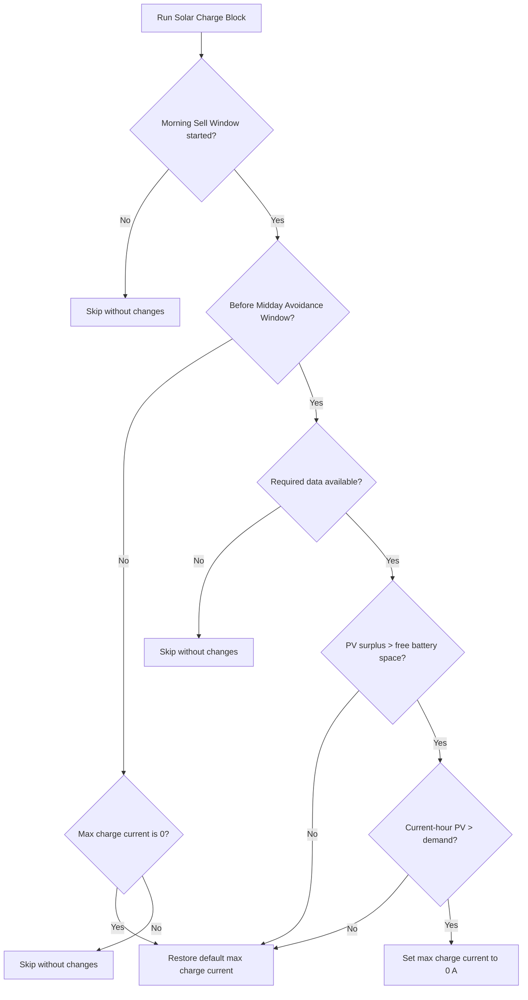

# Solar Charge Block — opis akcji

## Cel

`Solar Charge Block` opóźnia ładowanie baterii z PV, gdy eksport energii
słonecznej nadal ma wysoką wartość. Akcja chroni jednocześnie przed sytuacją,
w której prognozowana nadwyżka PV nie zmieści się później w baterii.

Jedynym efektem sterującym akcji jest zmiana maksymalnego prądu ładowania:

- `0 A`, gdy ładowanie ma pozostać zablokowane;
- `DEFAULT_MAX_CHARGE_CURRENT`, gdy ładowanie ma zostać przywrócone.

Akcja nie zmienia trybu pracy falownika, nie zapisuje SOC aktywnego programu
i nie korzysta z `min_soc_pv`. Nie uruchamia ani nie wspiera Forced Battery
Discharge — energia już zgromadzona w baterii nie jest sprzedawana przez tę
akcję.

## Wyzwalanie

- Scheduler uruchamia kontrolę co godzinę o `:01` w czasie dnia.
- Akcję można uruchomić ręcznie przez serwis
  `energy_optimizer.solar_charge_block`.
- Guardy biznesowe znajdują się w samej logice decyzji, dlatego wywołanie
  ręczne i harmonogram zachowują się tak samo.
- Przed początkiem Morning Sell Window akcja nie wykonuje żadnej zmiany.
- Od czasu Midday Avoidance Window włącznie akcja nie blokuje ładowania; jeśli
  bieżący `max_charge_current_entity` ma wartość `0`, przywraca
  `DEFAULT_MAX_CHARGE_CURRENT`.

## Dane wejściowe

- czas początku wewnętrznego sensora Morning Sell Window;
- czas wewnętrznego sensora Midday Avoidance Window (`consume_window`,
  z dotychczasowym fallbackiem);
- prognoza PV od bieżącej godziny do zachodu słońca;
- prognoza PV dla bieżącej godziny;
- wolne miejsce w baterii z `battery_space_sensor`;
- lokalne zapotrzebowanie w bieżącej godzinie;
- encja `max_charge_current_entity`.

Brak prognozy PV, czasu zachodu lub informacji o wolnym miejscu w baterii
powoduje pominięcie akcji bez zmiany falownika.

## Guardy PV

Blokada jest aktywowana tylko wtedy, gdy oba warunki są prawdziwe:

1. prognozowana nadwyżka PV do zachodu słońca przekracza wolne miejsce
   w baterii;
2. prognoza PV w bieżącej godzinie przekracza lokalne zapotrzebowanie
   uwzględniające zużycie domu, pompę ciepła, straty i margines `1.1`.

Jeśli którykolwiek ze znanych guardów PV staje się fałszywy po rozpoczęciu
Morning Sell Window, ale przed Midday Avoidance Window, akcja przywraca
`DEFAULT_MAX_CHARGE_CURRENT`.

## Przebieg decyzji

## Przywrócenie i bezpieczeństwo

Solar Charge Block sam przywraca domyślny prąd ładowania, gdy znane warunki
blokady przestają być spełnione przed czasem Midday Avoidance Window. Od czasu
Midday Avoidance Window włącznie przywraca prąd tylko wtedy, gdy może potwierdzić,
że bieżący `max_charge_current_entity` wynosi `0`.

Brak danych nie jest traktowany jako fałszywy warunek: w takim przypadku nie
jest wykonywane ani blokowanie, ani przywrócenie.

## Logowanie

Logi rozróżniają:

- pominięcie przed Morning Sell Window;
- pominięcie lub przywrócenie po Midday Avoidance Window;
- pominięcie z powodu brakujących danych;
- przywrócenie z powodu pojemności lub bieżącego bilansu PV;
- blokadę wraz z wartościami guardów PV.
